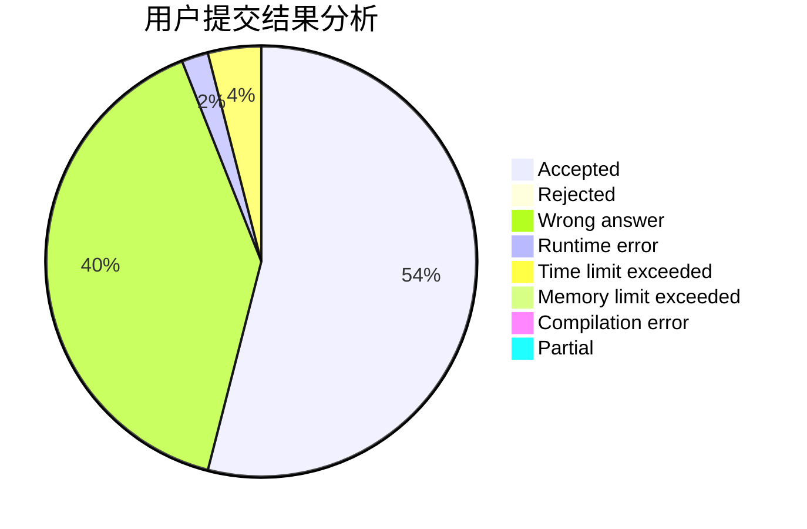
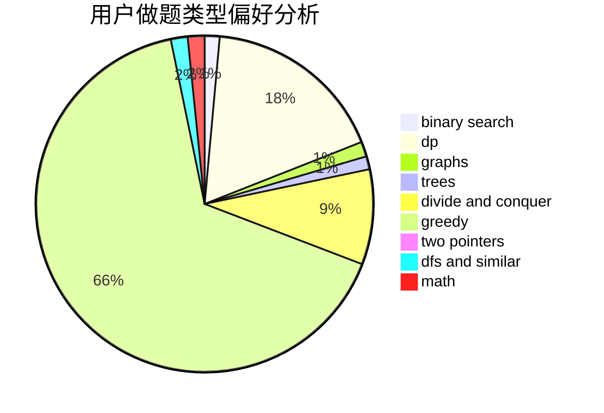

# nefuccz

<!-- tabs:start -->

#### **用户提交结果分析**

#### **用户做题类型偏好分析**

<!-- tabs:end -->
# 推荐题目
[1408H](https://codeforces.com/contest/1408/problem/H)
[482E](https://codeforces.com/contest/482/problem/E)
[426B](https://codeforces.com/contest/426/problem/B)
[1369F](https://codeforces.com/contest/1369/problem/F)
[821A](https://codeforces.com/contest/821/problem/A)
[864A](https://codeforces.com/contest/864/problem/A)
[906E](https://codeforces.com/contest/906/problem/E)
[702B](https://codeforces.com/contest/702/problem/B)
[427B](https://codeforces.com/contest/427/problem/B)
[784D](https://codeforces.com/contest/784/problem/D)
