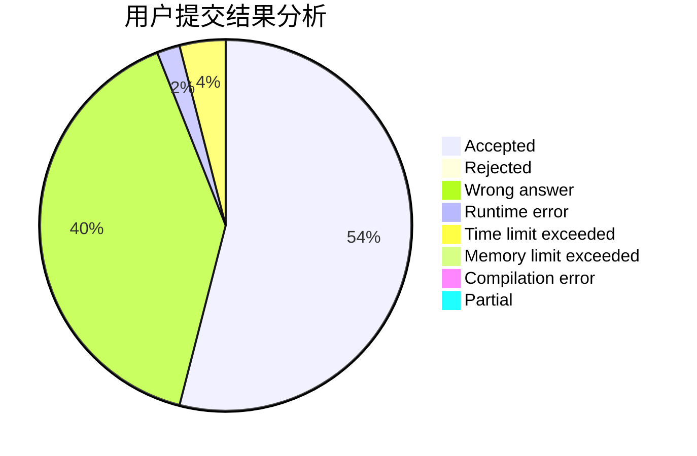
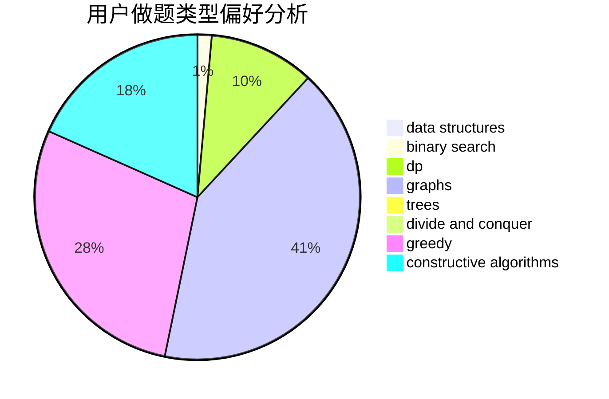
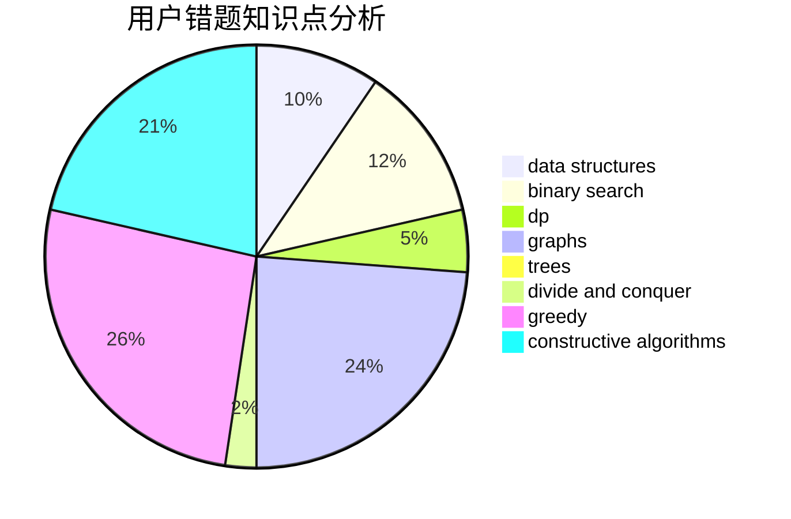

# nefuccz

<!-- tabs:start -->

#### **用户提交结果分析**

#### **用户做题类型偏好分析**

#### **用户错题知识点分析**

<!-- tabs:end -->
# 推荐题目
[1399F](https://codeforces.com/contest/1399/problem/F)		data structures,
                        dp,
                        graphs,
                        sortings		  
[463A](https://codeforces.com/contest/463/problem/A)		brute force,
                        implementation		  
[39D](https://codeforces.com/contest/39/problem/D)		math		  
[1362A](https://codeforces.com/contest/1362/problem/A)		implementation		  
[804F](https://codeforces.com/contest/804/problem/F)		combinatorics,
                        dfs and similar,
                        dp,
                        graphs,
                        number theory		  
[845F](https://codeforces.com/contest/845/problem/F)		bitmasks,
                        dp		  
[887D](https://codeforces.com/contest/887/problem/D)		data structures,
                        two pointers		  
[678D](https://codeforces.com/contest/678/problem/D)		math,
                        number theory		  
[39E](https://codeforces.com/contest/39/problem/E)		dp,
                        games		  
[765A](https://codeforces.com/contest/765/problem/A)		implementation,
                        math		  
