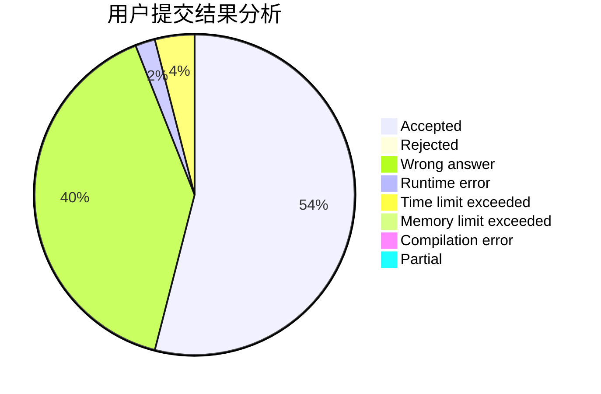
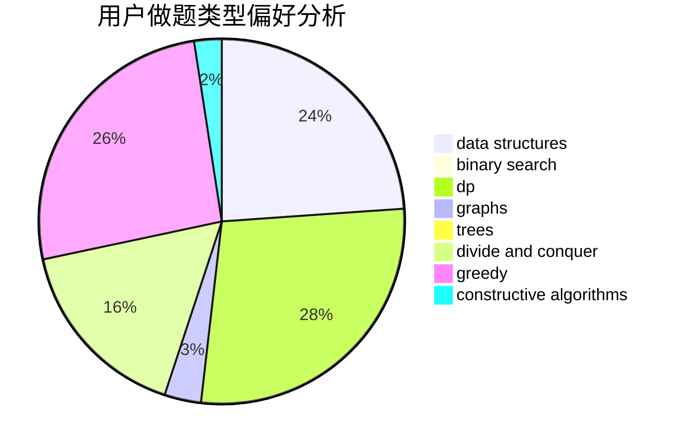
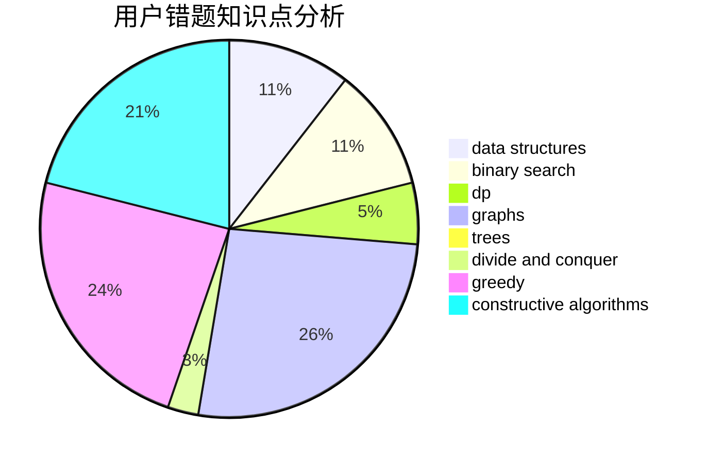

# nefuccz

<!-- tabs:start -->

#### **用户提交结果分析**

#### **用户做题类型偏好分析**

#### **用户错题知识点分析**

<!-- tabs:end -->
# 推荐题目
[1408H](https://codeforces.com/contest/1408/problem/H)		binary search,
                        data structures,
                        flows,
                        greedy		  
[482E](https://codeforces.com/contest/482/problem/E)		data structures,
                        trees		  
[426B](https://codeforces.com/contest/426/problem/B)		implementation		  
[1369F](https://codeforces.com/contest/1369/problem/F)		dfs and similar,
                        dp,
                        games		  
[821A](https://codeforces.com/contest/821/problem/A)		implementation		  
[864A](https://codeforces.com/contest/864/problem/A)		implementation,
                        sortings		  
[906E](https://codeforces.com/contest/906/problem/E)		dp,
                        string suffix structures,
                        strings		  
[702B](https://codeforces.com/contest/702/problem/B)		brute force,
                        data structures,
                        implementation,
                        math		  
[427B](https://codeforces.com/contest/427/problem/B)		data structures,
                        implementation		  
[784D](https://codeforces.com/contest/784/problem/D)		*special problem,
                        implementation		  
