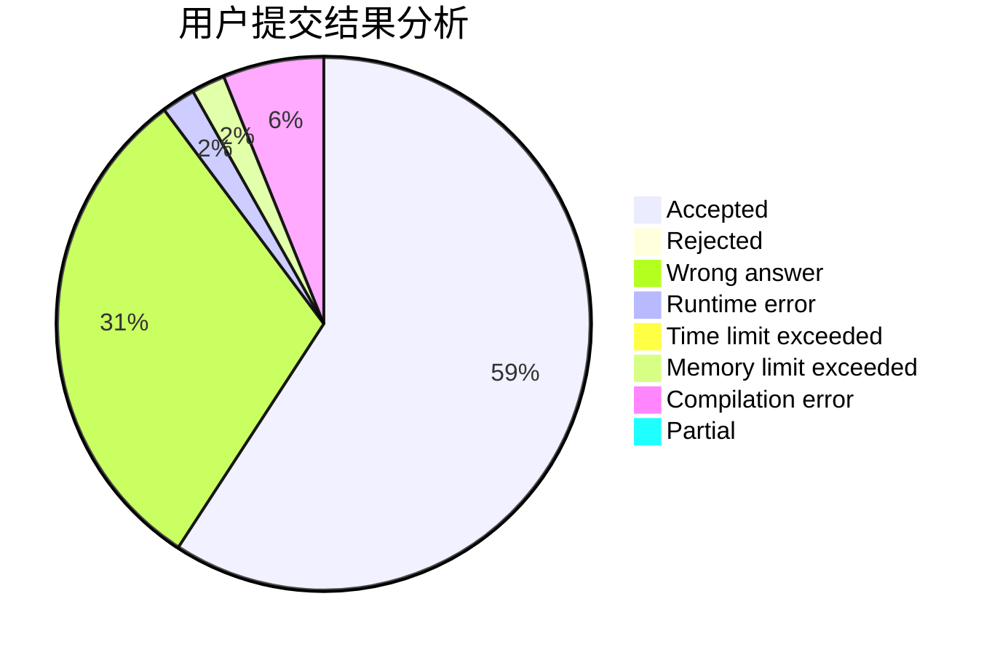
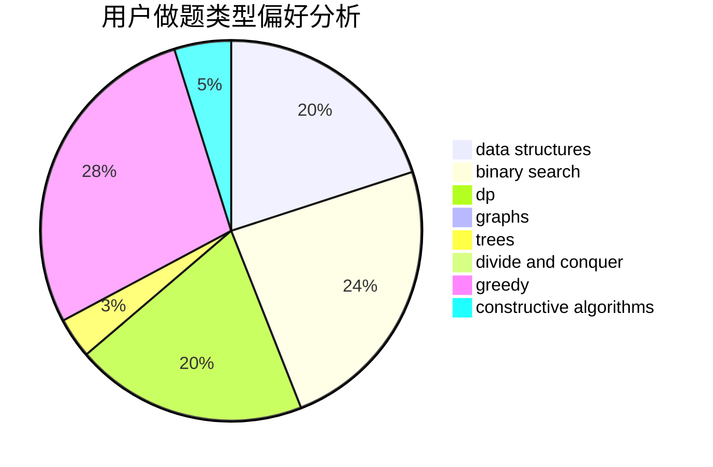

# negiizhao

<!-- tabs:start -->

#### **用户提交结果分析**

#### **用户做题类型偏好分析**

#### **用户错题知识点分析**

<!-- tabs:end -->
# 推荐题目
[1456B](https://codeforces.com/contest/1456/problem/B)		dsu,graphs,sortings,trees		  
[1067E](https://codeforces.com/contest/1067/problem/E)		dp,
                        graph matchings,
                        math,
                        trees		  
[900A](https://codeforces.com/contest/900/problem/A)		geometry,
                        implementation		  
[1369E](https://codeforces.com/contest/1369/problem/E)		data structures,
                        dfs and similar,
                        greedy,
                        implementation,
                        sortings		  
[1148H](https://codeforces.com/contest/1148/problem/H)		data structures		  
[63C](https://codeforces.com/contest/63/problem/C)		brute force,
                        implementation		  
[103C](https://codeforces.com/contest/103/problem/C)		constructive algorithms,
                        greedy		  
[835B](https://codeforces.com/contest/835/problem/B)		greedy		  
[1334F](https://codeforces.com/contest/1334/problem/F)		binary search,
                        data structures,
                        dp,
                        greedy		  
[44E](https://codeforces.com/contest/44/problem/E)		dp		  
