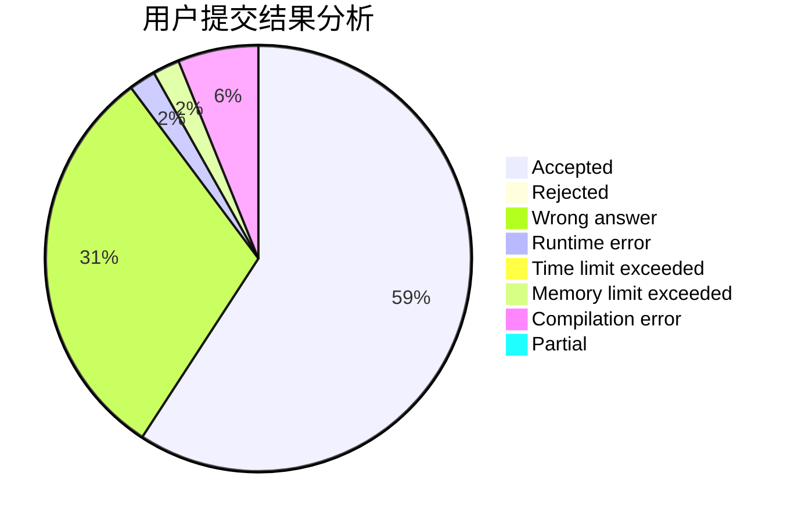
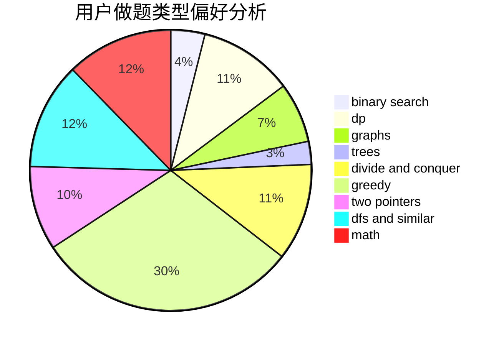

# negiizhao

<!-- tabs:start -->

#### **用户提交结果分析**

#### **用户做题类型偏好分析**

<!-- tabs:end -->
# 推荐题目
[1465F](https://codeforces.com/contest/1465/problem/F)
[1068C](https://codeforces.com/contest/1068/problem/C)
[916D](https://codeforces.com/contest/916/problem/D)
[13764](https://codeforces.com/contest/1376/problem/4)
[1150C](https://codeforces.com/contest/1150/problem/C)
[6701](https://codeforces.com/contest/670/problem/1)
[1040A](https://codeforces.com/contest/1040/problem/A)
[852I](https://codeforces.com/contest/852/problem/I)
[1341E](https://codeforces.com/contest/1341/problem/E)
[471D](https://codeforces.com/contest/471/problem/D)
