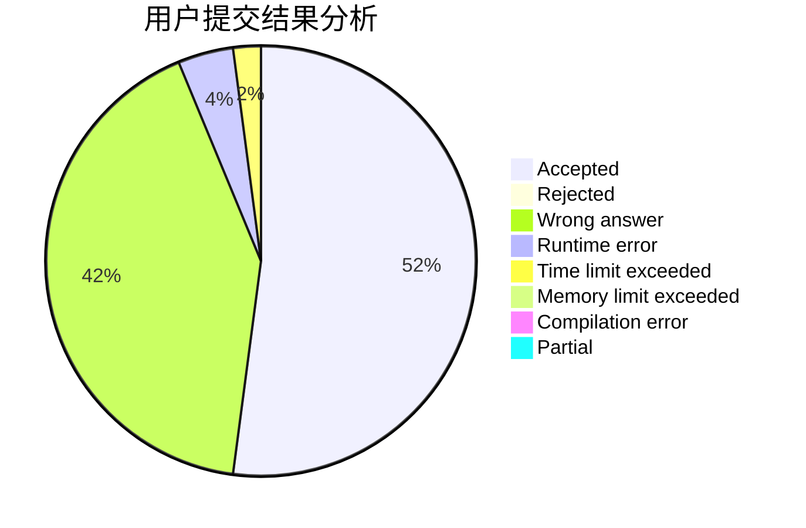
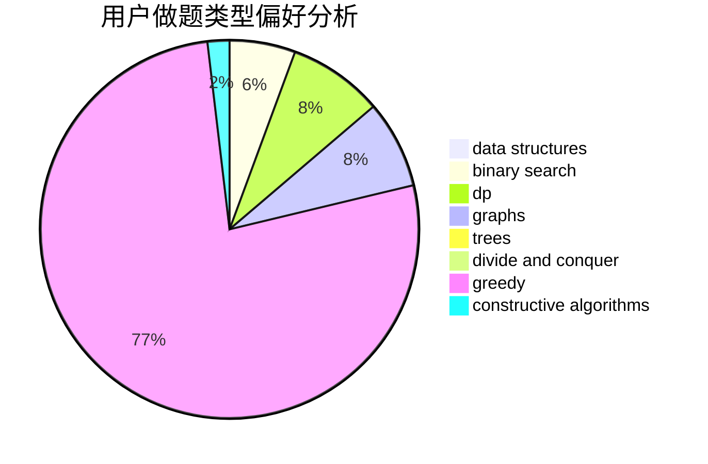
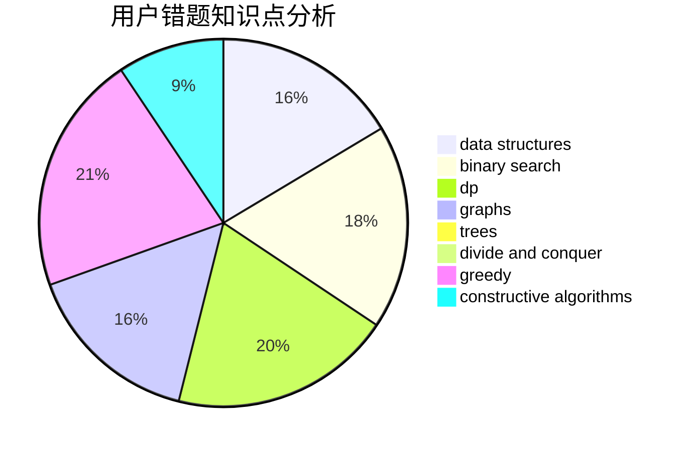

# nenuybtd

<!-- tabs:start -->

#### **用户提交结果分析**

#### **用户做题类型偏好分析**

#### **用户错题知识点分析**

<!-- tabs:end -->
# 推荐题目
[1436A](https://codeforces.com/contest/1436/problem/A)		math		  
[662D](https://codeforces.com/contest/662/problem/D)		constructive algorithms,
                        greedy,
                        implementation,
                        math		  
[643D](https://codeforces.com/contest/643/problem/D)		nan		  
[835B](https://codeforces.com/contest/835/problem/B)		greedy		  
[793D](https://codeforces.com/contest/793/problem/D)		dp,
                        graphs,
                        shortest paths		  
[935F](https://codeforces.com/contest/935/problem/F)		data structures,
                        greedy		  
[121C](https://codeforces.com/contest/121/problem/C)		brute force,
                        combinatorics,
                        number theory		  
[1079D](https://codeforces.com/contest/1079/problem/D)		dsu,graphs,sortings,trees		  
[34A](https://codeforces.com/contest/34/problem/A)		implementation		  
[902A](https://codeforces.com/contest/902/problem/A)		greedy,
                        implementation		  
