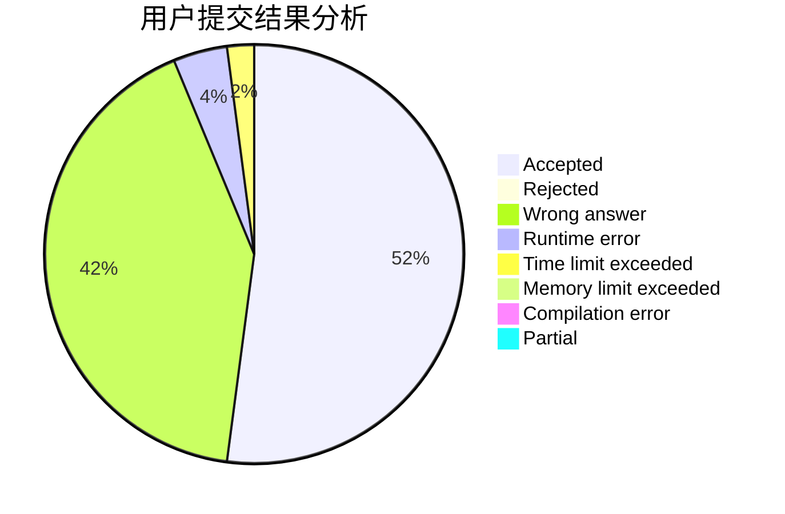
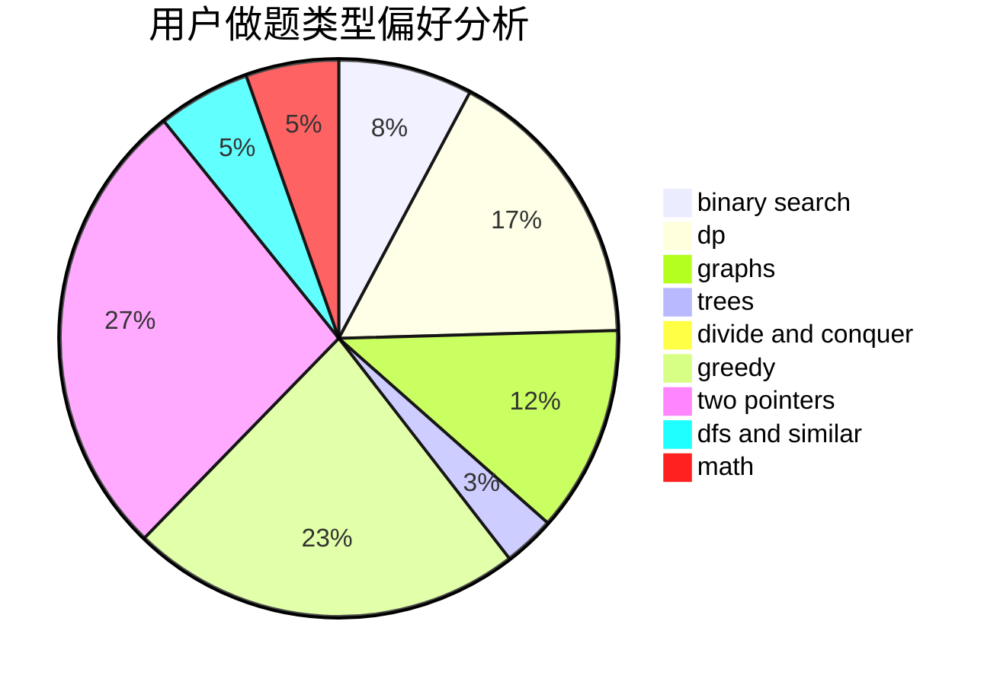

# nenuybtd

<!-- tabs:start -->

#### **用户提交结果分析**

#### **用户做题类型偏好分析**

<!-- tabs:end -->
# 推荐题目
[14461](https://codeforces.com/contest/1446/problem/1)
[682D](https://codeforces.com/contest/682/problem/D)
[670B](https://codeforces.com/contest/670/problem/B)
[852I](https://codeforces.com/contest/852/problem/I)
[808F](https://codeforces.com/contest/808/problem/F)
[957E](https://codeforces.com/contest/957/problem/E)
[1227A](https://codeforces.com/contest/1227/problem/A)
[107C](https://codeforces.com/contest/107/problem/C)
[376B](https://codeforces.com/contest/376/problem/B)
[918C](https://codeforces.com/contest/918/problem/C)
