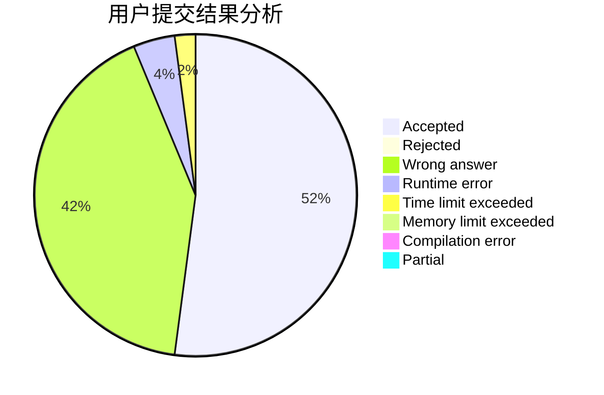
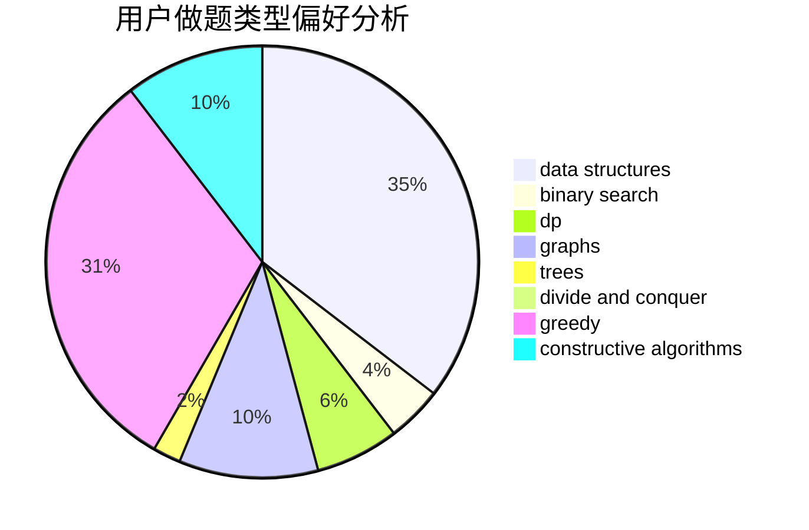
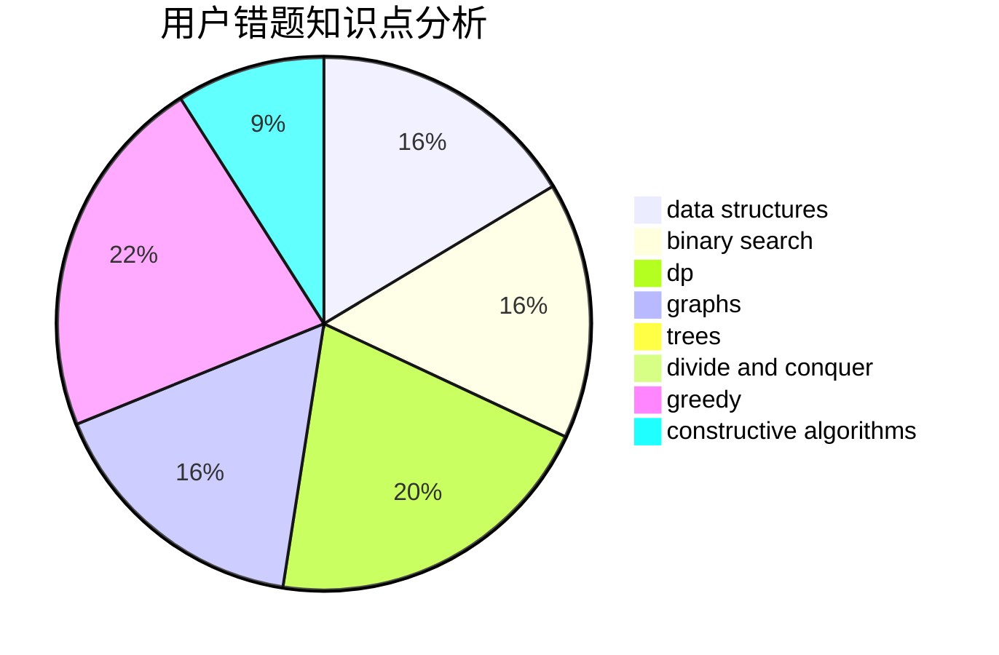

# nenuybtd

<!-- tabs:start -->

#### **用户提交结果分析**

#### **用户做题类型偏好分析**

#### **用户错题知识点分析**

<!-- tabs:end -->
# 推荐题目
[14461](https://codeforces.com/contest/1446/problem/1)		dsu,graphs,sortings,trees		  
[682D](https://codeforces.com/contest/682/problem/D)		dp,
                        strings		  
[670B](https://codeforces.com/contest/670/problem/B)		implementation		  
[852I](https://codeforces.com/contest/852/problem/I)		brute force,
                        dfs and similar,
                        graphs,
                        trees		  
[808F](https://codeforces.com/contest/808/problem/F)		binary search,
                        flows,
                        graphs		  
[957E](https://codeforces.com/contest/957/problem/E)		dsu,graphs,sortings,trees		  
[1227A](https://codeforces.com/contest/1227/problem/A)		math		  
[107C](https://codeforces.com/contest/107/problem/C)		bitmasks,
                        dp		  
[376B](https://codeforces.com/contest/376/problem/B)		implementation		  
[918C](https://codeforces.com/contest/918/problem/C)		dsu,graphs,sortings,trees		  
