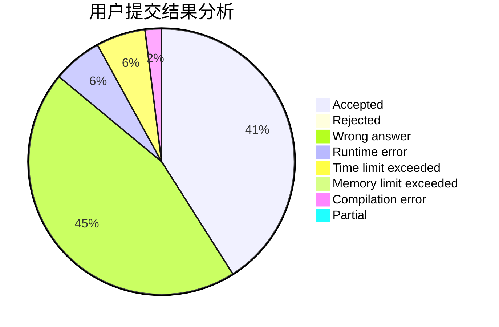
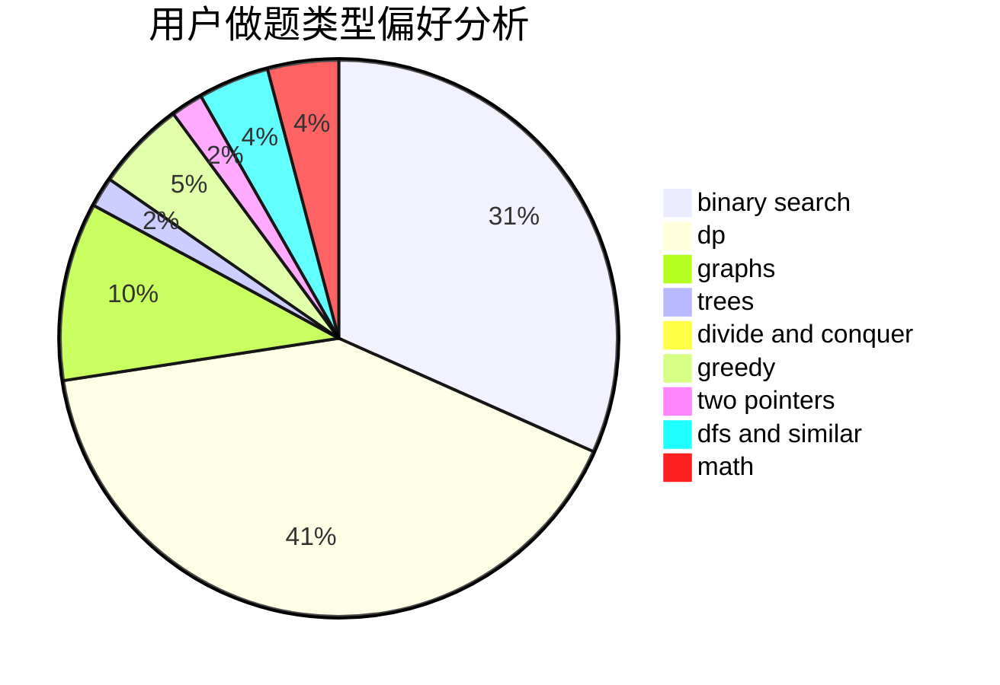

# newTarget

<!-- tabs:start -->

#### **用户提交结果分析**

#### **用户做题类型偏好分析**

<!-- tabs:end -->
# 推荐题目
[1280E](https://codeforces.com/contest/1280/problem/E)
[883C](https://codeforces.com/contest/883/problem/C)
[797C](https://codeforces.com/contest/797/problem/C)
[218D](https://codeforces.com/contest/218/problem/D)
[34C](https://codeforces.com/contest/34/problem/C)
[284E](https://codeforces.com/contest/284/problem/E)
[741A](https://codeforces.com/contest/741/problem/A)
[436A](https://codeforces.com/contest/436/problem/A)
[1113C](https://codeforces.com/contest/1113/problem/C)
[173E](https://codeforces.com/contest/173/problem/E)
