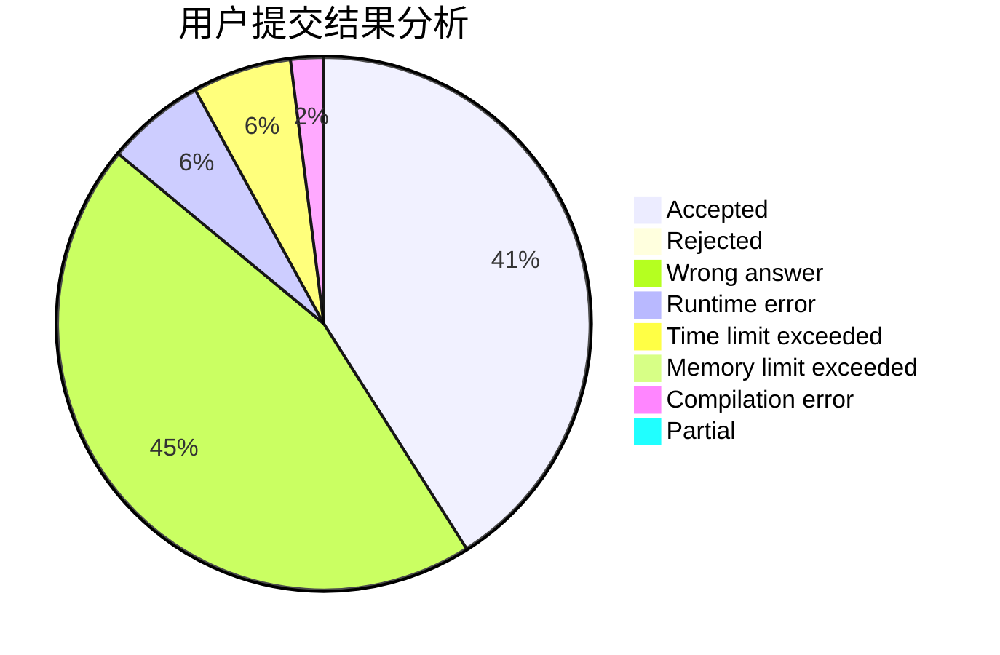
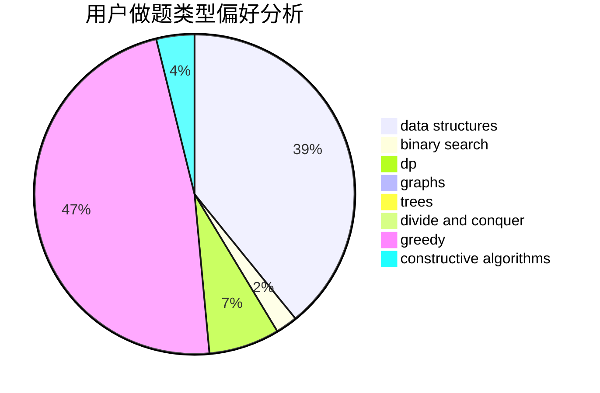

# newTarget

<!-- tabs:start -->

#### **用户提交结果分析**

#### **用户做题类型偏好分析**

#### **用户错题知识点分析**

<!-- tabs:end -->
# 推荐题目
[1271C](https://codeforces.com/contest/1271/problem/C)		brute force,
                        geometry,
                        greedy,
                        implementation		  
[863A](https://codeforces.com/contest/863/problem/A)		brute force,
                        implementation		  
[779A](https://codeforces.com/contest/779/problem/A)		constructive algorithms,
                        math		  
[196E](https://codeforces.com/contest/196/problem/E)		dsu,
                        graphs,
                        shortest paths		  
[319C](https://codeforces.com/contest/319/problem/C)		dp,
                        geometry		  
[269B](https://codeforces.com/contest/269/problem/B)		dp		  
[723D](https://codeforces.com/contest/723/problem/D)		dfs and similar,
                        dsu,
                        graphs,
                        greedy,
                        implementation		  
[407B](https://codeforces.com/contest/407/problem/B)		dp,
                        implementation		  
[1111E](https://codeforces.com/contest/1111/problem/E)		data structures,
                        dfs and similar,
                        dp,
                        graphs,
                        trees		  
[1513E](https://codeforces.com/contest/1513/problem/E)		combinatorics,
                        constructive algorithms,
                        math,
                        sortings		  
