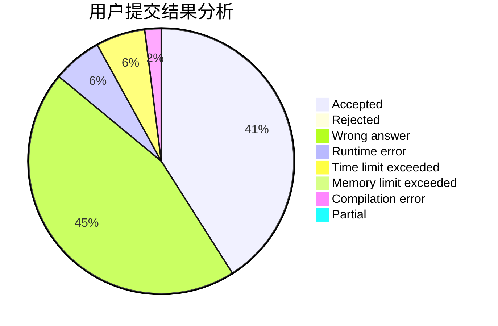
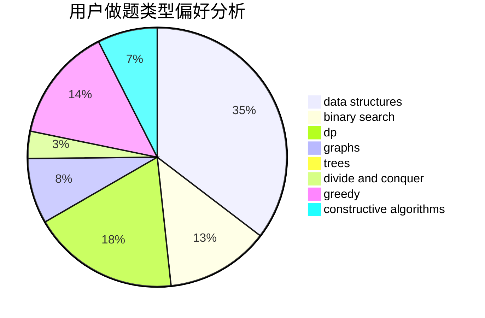

# newTarget

<!-- tabs:start -->

#### **用户提交结果分析**

#### **用户做题类型偏好分析**

#### **用户错题知识点分析**

<!-- tabs:end -->
# 推荐题目
[1280E](https://codeforces.com/contest/1280/problem/E)		math		  
[883C](https://codeforces.com/contest/883/problem/C)		binary search,
                        implementation		  
[797C](https://codeforces.com/contest/797/problem/C)		data structures,
                        greedy,
                        strings		  
[218D](https://codeforces.com/contest/218/problem/D)		dsu,graphs,sortings,trees		  
[34C](https://codeforces.com/contest/34/problem/C)		expression parsing,
                        implementation,
                        sortings,
                        strings		  
[284E](https://codeforces.com/contest/284/problem/E)		dsu,graphs,sortings,trees		  
[741A](https://codeforces.com/contest/741/problem/A)		dfs and similar,
                        math		  
[436A](https://codeforces.com/contest/436/problem/A)		greedy		  
[1113C](https://codeforces.com/contest/1113/problem/C)		dsu,graphs,sortings,trees		  
[173E](https://codeforces.com/contest/173/problem/E)		data structures,
                        sortings		  
