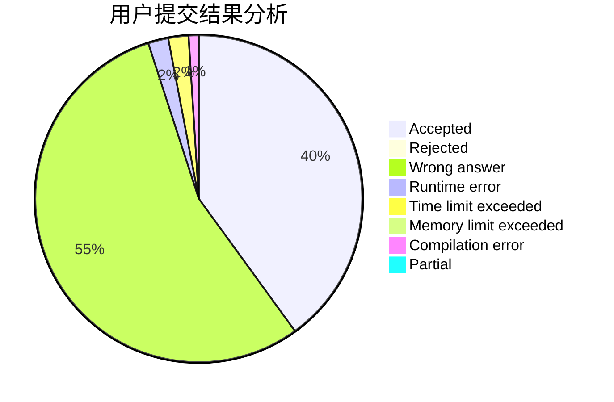
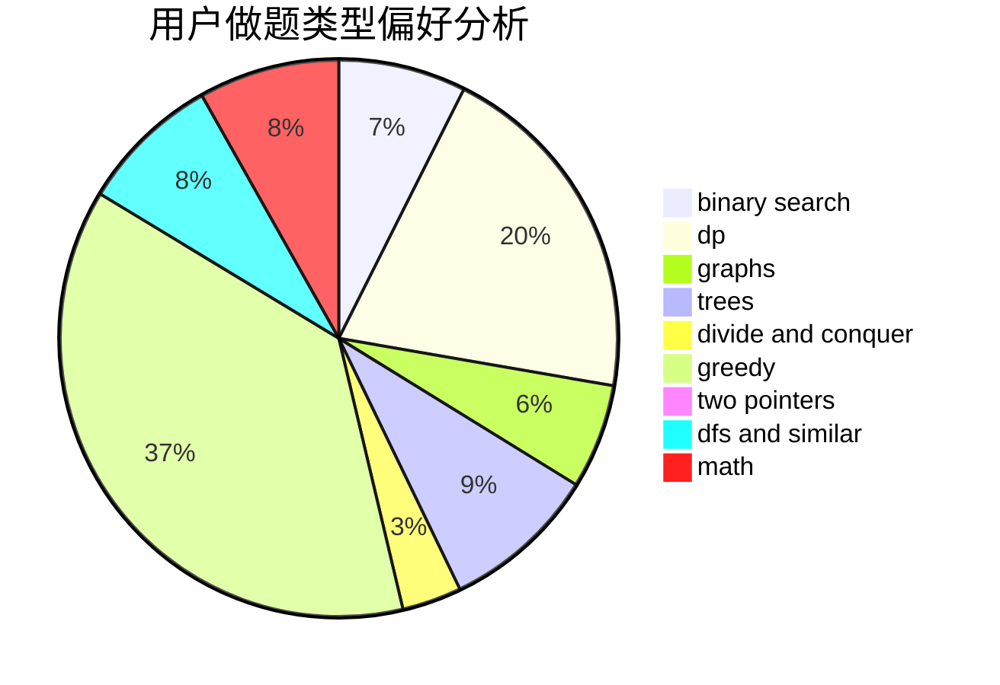

# new_kioc1

<!-- tabs:start -->

#### **用户提交结果分析**

#### **用户做题类型偏好分析**

<!-- tabs:end -->
# 推荐题目
[1401C](https://codeforces.com/contest/1401/problem/C)
[1058B](https://codeforces.com/contest/1058/problem/B)
[1039B](https://codeforces.com/contest/1039/problem/B)
[1344F](https://codeforces.com/contest/1344/problem/F)
[1183D](https://codeforces.com/contest/1183/problem/D)
[743A](https://codeforces.com/contest/743/problem/A)
[27D](https://codeforces.com/contest/27/problem/D)
[963B](https://codeforces.com/contest/963/problem/B)
[290C](https://codeforces.com/contest/290/problem/C)
[312A](https://codeforces.com/contest/312/problem/A)
