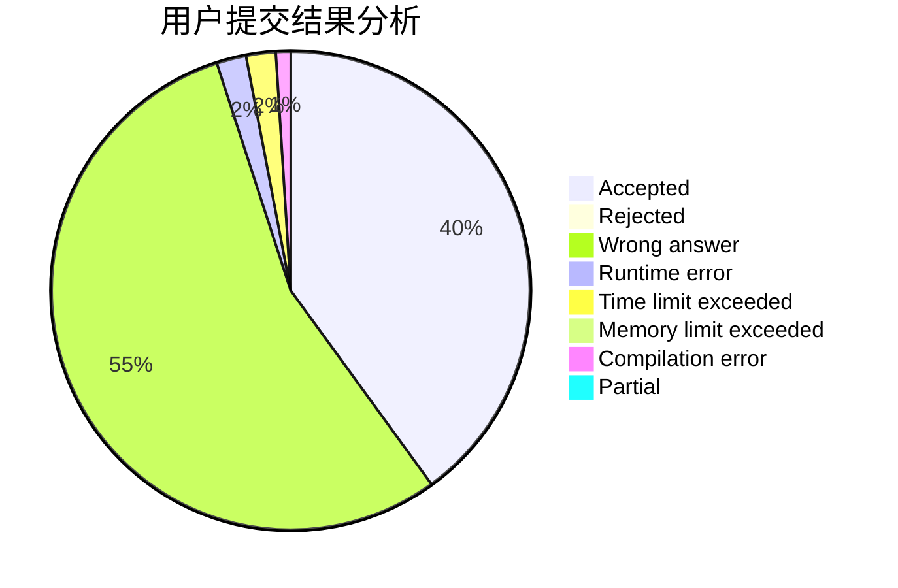
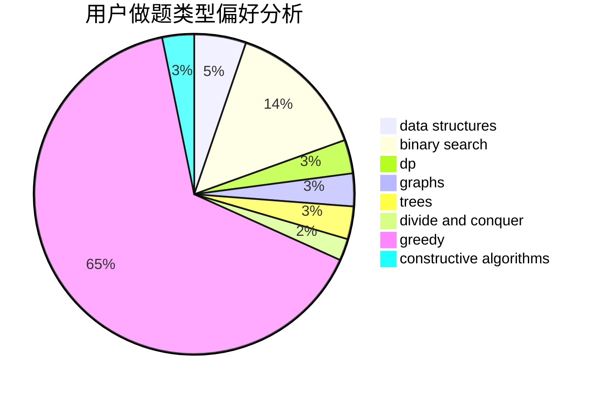

# new_kioc1
<!-- tabs:start -->
#### **用户提交结果分析**

#### **用户做题类型偏好分析**

#### **用户错题知识点分析**

<!-- tabs:end -->
# 推荐题目
[Strange Table](http://codeforces.com/problemset/problem/1506/A)		math		  
[Super Jaber](http://codeforces.com/problemset/problem/1301/F)		dfs and similar,
                        graphs,
                        implementation,
                        shortest paths		  
[MEX Queries](http://codeforces.com/problemset/problem/817/F)		binary search,
                        data structures,
                        trees		  
[Greg and Friends](http://codeforces.com/problemset/problem/295/C)		combinatorics,
                        dp,
                        graphs,
                        shortest paths		  
[Slime](http://codeforces.com/problemset/problem/1038/D)		dp,
                        greedy,
                        implementation		  
[Beautiful Matrix](http://codeforces.com/problemset/problem/263/A)		implementation		  
[Little Girl and Maximum Sum](http://codeforces.com/problemset/problem/276/C)		data structures,
                        greedy,
                        implementation,
                        sortings		  
[Badge](http://codeforces.com/problemset/problem/1020/B)		brute force,
                        dfs and similar,
                        graphs		  
[Milking cows](http://codeforces.com/problemset/problem/383/A)		data structures,
                        greedy		  
[Largest Beautiful Number](http://codeforces.com/problemset/problem/946/E)		greedy,
                        implementation		  
<!-- tabs:start -->
#### **data structures**
[Strange Table](http://codeforces.com/problemset/problem/817/F)		binary search,
                        data structures,
                        trees		  
[Super Jaber](http://codeforces.com/problemset/problem/276/C)		data structures,
                        greedy,
                        implementation,
                        sortings		  
[MEX Queries](http://codeforces.com/problemset/problem/383/A)		data structures,
                        greedy		  
[Greg and Friends](https://codeforces.com/contest/1180/problem/C)		data structures,
                        implementation		  
[Slime](http://codeforces.com/problemset/problem/707/E)		data structures		  
[Beautiful Matrix](http://codeforces.com/problemset/problem/762/E)		binary search,
                        data structures		  
[Little Girl and Maximum Sum](http://codeforces.com/problemset/problem/601/D)		data structures,
                        dfs and similar,
                        dsu,
                        hashing,
                        strings,
                        trees		  
[Badge](http://codeforces.com/problemset/problem/1060/G)		data structures		  
[Milking cows](http://codeforces.com/problemset/problem/1343/F)		brute force,
                        constructive algorithms,
                        data structures,
                        greedy,
                        implementation		  
[Largest Beautiful Number](http://codeforces.com/problemset/problem/938/G)		bitmasks,
                        data structures,
                        dsu,
                        graphs		  
#### **binary search**
[Strange Table](http://codeforces.com/problemset/problem/817/F)		binary search,
                        data structures,
                        trees		  
[Super Jaber](http://codeforces.com/problemset/problem/762/E)		binary search,
                        data structures		  
[MEX Queries](http://codeforces.com/problemset/problem/830/A)		binary search,
                        brute force,
                        dp,
                        greedy,
                        sortings		  
[Greg and Friends](http://codeforces.com/problemset/problem/961/F)		binary search,
                        hashing,
                        string suffix structures		  
[Slime](https://codeforces.com/contest/1337/problem/D)		binary search,
                        greedy,
                        math,
                        sortings,
                        two pointers		  
[Beautiful Matrix](http://codeforces.com/problemset/problem/1271/E)		binary search,
                        combinatorics,
                        dp,
                        math		  
[Little Girl and Maximum Sum](http://codeforces.com/problemset/problem/1492/C)		binary search,
                        data structures,
                        dp,
                        greedy,
                        two pointers		  
[Badge](http://codeforces.com/problemset/problem/1463/D)		binary search,
                        constructive algorithms,
                        greedy,
                        two pointers		  
[Milking cows](http://codeforces.com/problemset/problem/1490/G)		binary search,
                        data structures,
                        math		  
[Largest Beautiful Number](http://codeforces.com/problemset/problem/1479/D)		binary search,
                        bitmasks,
                        brute force,
                        data structures,
                        probabilities,
                        trees		  
#### **dp**
[Strange Table](http://codeforces.com/problemset/problem/295/C)		combinatorics,
                        dp,
                        graphs,
                        shortest paths		  
[Super Jaber](http://codeforces.com/problemset/problem/1038/D)		dp,
                        greedy,
                        implementation		  
[MEX Queries](http://codeforces.com/problemset/problem/755/F)		bitmasks,
                        dp,
                        greedy		  
[Greg and Friends](http://codeforces.com/problemset/problem/377/C)		bitmasks,
                        dp,
                        games		  
[Slime](http://codeforces.com/problemset/problem/1393/D)		dfs and similar,
                        dp,
                        implementation,
                        shortest paths		  
[Beautiful Matrix](http://codeforces.com/problemset/problem/830/D)		combinatorics,
                        dp,
                        graphs,
                        trees		  
[Little Girl and Maximum Sum](http://codeforces.com/problemset/problem/830/A)		binary search,
                        brute force,
                        dp,
                        greedy,
                        sortings		  
[Badge](http://codeforces.com/problemset/problem/855/C)		dp,
                        trees		  
[Milking cows](http://codeforces.com/problemset/problem/1239/E)		dp,
                        implementation		  
[Largest Beautiful Number](http://codeforces.com/problemset/problem/1271/E)		binary search,
                        combinatorics,
                        dp,
                        math		  
#### **graph**
[Strange Table](http://codeforces.com/problemset/problem/1301/F)		dfs and similar,
                        graphs,
                        implementation,
                        shortest paths		  
[Super Jaber](http://codeforces.com/problemset/problem/295/C)		combinatorics,
                        dp,
                        graphs,
                        shortest paths		  
[MEX Queries](http://codeforces.com/problemset/problem/1020/B)		brute force,
                        dfs and similar,
                        graphs		  
[Greg and Friends](http://codeforces.com/problemset/problem/830/D)		combinatorics,
                        dp,
                        graphs,
                        trees		  
[Slime](http://codeforces.com/problemset/problem/1184/E2)		dfs and similar,
                        graphs,
                        shortest paths,
                        trees		  
[Beautiful Matrix](http://codeforces.com/problemset/problem/938/G)		bitmasks,
                        data structures,
                        dsu,
                        graphs		  
[Little Girl and Maximum Sum](https://codeforces.com/contest/1464/problem/A)		dfs and similar,
                        dsu,
                        graphs		  
[Badge](http://codeforces.com/problemset/problem/1487/C)		brute force,
                        constructive algorithms,
                        dfs and similar,
                        graphs,
                        greedy,
                        implementation,
                        math		  
[Milking cows](http://codeforces.com/problemset/problem/1437/C)		dp,
                        flows,
                        graph matchings,
                        greedy,
                        math,
                        sortings		  
[Largest Beautiful Number](http://codeforces.com/problemset/problem/1470/D)		constructive algorithms,
                        dfs and similar,
                        graph matchings,
                        graphs,
                        greedy		  
#### **trees**
[Strange Table](http://codeforces.com/problemset/problem/817/F)		binary search,
                        data structures,
                        trees		  
[Super Jaber](http://codeforces.com/problemset/problem/1057/A)		*special problem,
                        dfs and similar,
                        trees		  
[MEX Queries](http://codeforces.com/problemset/problem/830/D)		combinatorics,
                        dp,
                        graphs,
                        trees		  
[Greg and Friends](http://codeforces.com/problemset/problem/601/D)		data structures,
                        dfs and similar,
                        dsu,
                        hashing,
                        strings,
                        trees		  
[Slime](http://codeforces.com/problemset/problem/1184/E2)		dfs and similar,
                        graphs,
                        shortest paths,
                        trees		  
[Beautiful Matrix](http://codeforces.com/problemset/problem/1210/C)		math,
                        number theory,
                        trees		  
[Little Girl and Maximum Sum](http://codeforces.com/problemset/problem/1088/F)		data structures,
                        trees		  
[Badge](http://codeforces.com/problemset/problem/855/C)		dp,
                        trees		  
[Milking cows](http://codeforces.com/problemset/problem/1479/D)		binary search,
                        bitmasks,
                        brute force,
                        data structures,
                        probabilities,
                        trees		  
[Largest Beautiful Number](http://codeforces.com/problemset/problem/1511/C)		brute force,
                        data structures,
                        implementation,
                        trees		  
#### **divide and conquer**
[Strange Table](http://codeforces.com/problemset/problem/1461/D)		binary search,
                        brute force,
                        data structures,
                        divide and conquer,
                        implementation,
                        sortings		  
[Super Jaber](http://codeforces.com/problemset/problem/1466/G)		combinatorics,
                        divide and conquer,
                        hashing,
                        math,
                        string suffix structures,
                        strings		  
[MEX Queries](http://codeforces.com/problemset/problem/1490/D)		dfs and similar,
                        divide and conquer,
                        implementation		  
[Greg and Friends](https://codeforces.com/contest/1483/problem/C)		data structures,
                        divide and conquer,
                        dp		  
[Slime](http://codeforces.com/problemset/problem/1491/E)		brute force,
                        dfs and similar,
                        divide and conquer,
                        number theory,
                        trees		  
[Beautiful Matrix](http://codeforces.com/problemset/problem/1303/G)		data structures,
                        divide and conquer,
                        geometry,
                        trees		  
[Little Girl and Maximum Sum](http://codeforces.com/problemset/problem/1494/D)		constructive algorithms,
                        data structures,
                        dfs and similar,
                        divide and conquer,
                        dsu,
                        greedy,
                        sortings,
                        trees		  
[Badge](http://codeforces.com/problemset/problem/1482/E)		data structures,
                        divide and conquer,
                        dp		  
[Milking cows](http://codeforces.com/problemset/problem/566/C)		dfs and similar,
                        divide and conquer,
                        trees		  
[Largest Beautiful Number](http://codeforces.com/problemset/problem/1428/F)		binary search,
                        data structures,
                        divide and conquer,
                        dp,
                        two pointers		  
#### **greedy**
[Strange Table](http://codeforces.com/problemset/problem/1038/D)		dp,
                        greedy,
                        implementation		  
[Super Jaber](http://codeforces.com/problemset/problem/276/C)		data structures,
                        greedy,
                        implementation,
                        sortings		  
[MEX Queries](http://codeforces.com/problemset/problem/383/A)		data structures,
                        greedy		  
[Greg and Friends](http://codeforces.com/problemset/problem/946/E)		greedy,
                        implementation		  
[Slime](http://codeforces.com/problemset/problem/605/A)		constructive algorithms,
                        greedy		  
[Beautiful Matrix](http://codeforces.com/problemset/problem/755/F)		bitmasks,
                        dp,
                        greedy		  
[Little Girl and Maximum Sum](http://codeforces.com/problemset/problem/830/A)		binary search,
                        brute force,
                        dp,
                        greedy,
                        sortings		  
[Badge](http://codeforces.com/problemset/problem/526/B)		dfs and similar,
                        greedy,
                        implementation		  
[Milking cows](http://codeforces.com/problemset/problem/379/C)		greedy,
                        sortings		  
[Largest Beautiful Number](http://codeforces.com/problemset/problem/1343/F)		brute force,
                        constructive algorithms,
                        data structures,
                        greedy,
                        implementation		  
#### **constructive algorithms**
[Strange Table](http://codeforces.com/problemset/problem/730/B)		constructive algorithms,
                        interactive		  
[Super Jaber](http://codeforces.com/problemset/problem/605/A)		constructive algorithms,
                        greedy		  
[MEX Queries](http://codeforces.com/problemset/problem/720/C)		constructive algorithms		  
[Greg and Friends](http://codeforces.com/problemset/problem/734/F)		bitmasks,
                        constructive algorithms,
                        implementation,
                        math		  
[Slime](http://codeforces.com/problemset/problem/1343/F)		brute force,
                        constructive algorithms,
                        data structures,
                        greedy,
                        implementation		  
[Beautiful Matrix](http://codeforces.com/problemset/problem/1513/F)		brute force,
                        constructive algorithms,
                        data structures,
                        sortings		  
[Little Girl and Maximum Sum](http://codeforces.com/problemset/problem/1208/C)		constructive algorithms		  
[Badge](http://codeforces.com/problemset/problem/1510/J)		constructive algorithms,
                        math		  
[Milking cows](http://codeforces.com/problemset/problem/1513/E)		combinatorics,
                        constructive algorithms,
                        math,
                        sortings		  
[Largest Beautiful Number](http://codeforces.com/problemset/problem/1493/A)		constructive algorithms,
                        greedy		  
#### **sortings**
[Strange Table](http://codeforces.com/problemset/problem/276/C)		data structures,
                        greedy,
                        implementation,
                        sortings		  
[Super Jaber](http://codeforces.com/problemset/problem/830/A)		binary search,
                        brute force,
                        dp,
                        greedy,
                        sortings		  
[MEX Queries](http://codeforces.com/problemset/problem/599/C)		sortings		  
[Greg and Friends](http://codeforces.com/problemset/problem/160/C)		implementation,
                        math,
                        sortings		  
[Slime](https://codeforces.com/contest/876/problem/D)		dsu,
                        implementation,
                        sortings,
                        two pointers		  
[Beautiful Matrix](http://codeforces.com/problemset/problem/379/C)		greedy,
                        sortings		  
[Little Girl and Maximum Sum](https://codeforces.com/contest/1337/problem/D)		binary search,
                        greedy,
                        math,
                        sortings,
                        two pointers		  
[Badge](http://codeforces.com/problemset/problem/1513/F)		brute force,
                        constructive algorithms,
                        data structures,
                        sortings		  
[Milking cows](http://codeforces.com/problemset/problem/1513/E)		combinatorics,
                        constructive algorithms,
                        math,
                        sortings		  
[Largest Beautiful Number](http://codeforces.com/problemset/problem/1455/D)		dp,
                        greedy,
                        sortings		  
<!-- tabs:end -->
