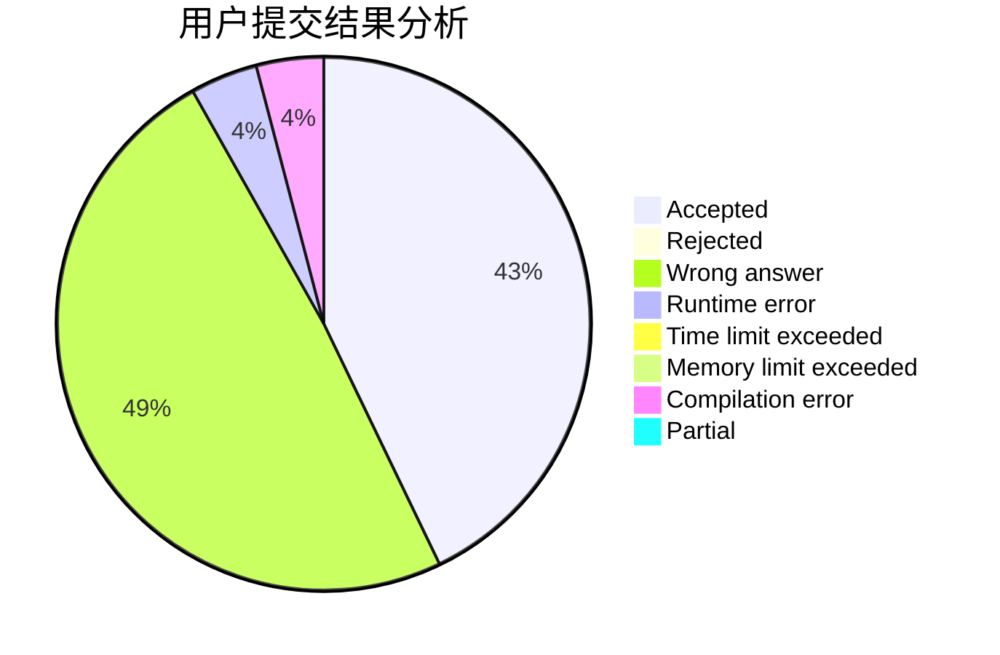
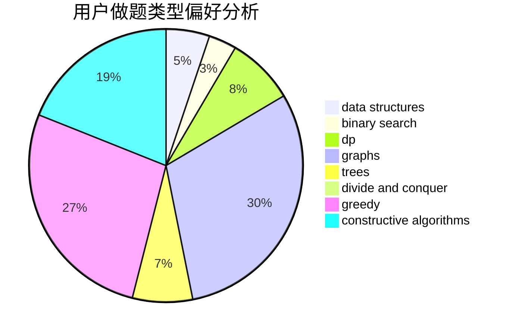
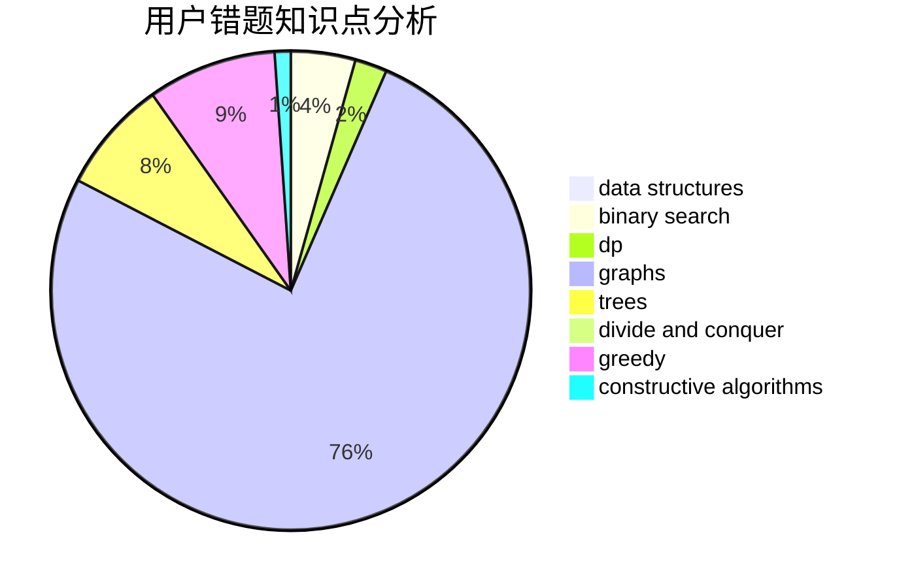

# Brave_Cattle

<!-- tabs:start -->

#### **用户提交结果分析**

#### **用户做题类型偏好分析**

#### **用户错题知识点分析**

<!-- tabs:end -->
# 推荐题目
[1513C](https://codeforces.com/contest/1513/problem/C)		dp,
                        matrices		  
[446E](https://codeforces.com/contest/446/problem/E)		math,
                        matrices		  
[580D](https://codeforces.com/contest/580/problem/D)		bitmasks,
                        dp		  
[466D](https://codeforces.com/contest/466/problem/D)		combinatorics,
                        dp		  
[582A](https://codeforces.com/contest/582/problem/A)		constructive algorithms,
                        greedy,
                        number theory		  
[580C](https://codeforces.com/contest/580/problem/C)		dfs and similar,
                        graphs,
                        trees		  
[581B](https://codeforces.com/contest/581/problem/B)		implementation,
                        math		  
[159D](https://codeforces.com/contest/159/problem/D)		*special problem,
                        brute force,
                        dp,
                        strings		  
[1372F](https://codeforces.com/contest/1372/problem/F)		binary search,
                        divide and conquer,
                        interactive		  
[581A](https://codeforces.com/contest/581/problem/A)		implementation,
                        math		  
