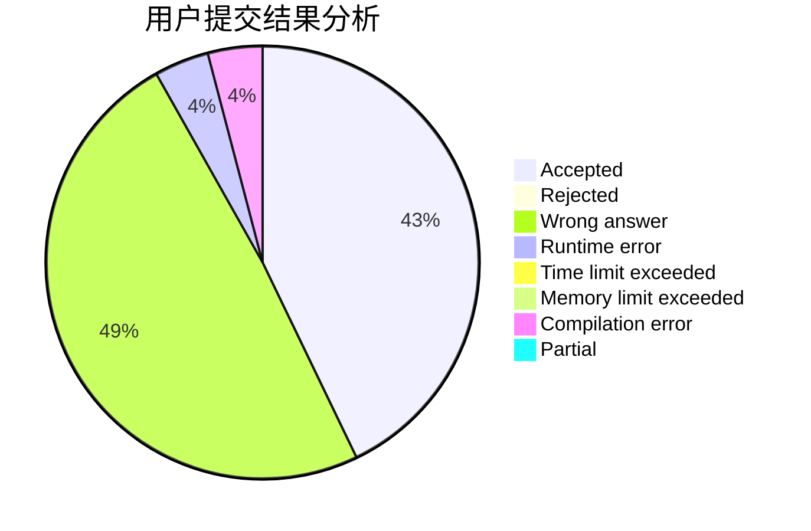
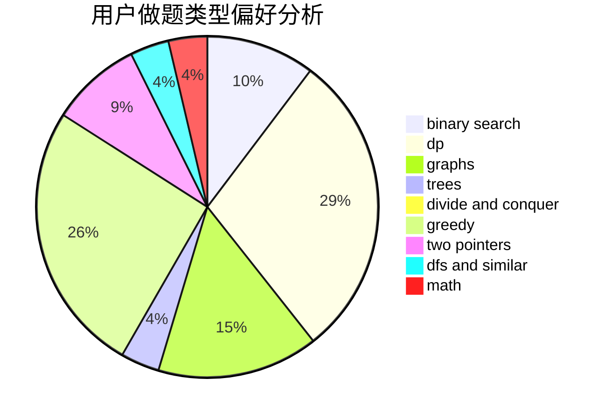

# Brave_Cattle

<!-- tabs:start -->

#### **用户提交结果分析**

#### **用户做题类型偏好分析**

<!-- tabs:end -->
# 推荐题目
[1513C](https://codeforces.com/contest/1513/problem/C)
[446E](https://codeforces.com/contest/446/problem/E)
[580D](https://codeforces.com/contest/580/problem/D)
[466D](https://codeforces.com/contest/466/problem/D)
[582A](https://codeforces.com/contest/582/problem/A)
[580C](https://codeforces.com/contest/580/problem/C)
[581B](https://codeforces.com/contest/581/problem/B)
[159D](https://codeforces.com/contest/159/problem/D)
[1372F](https://codeforces.com/contest/1372/problem/F)
[581A](https://codeforces.com/contest/581/problem/A)
