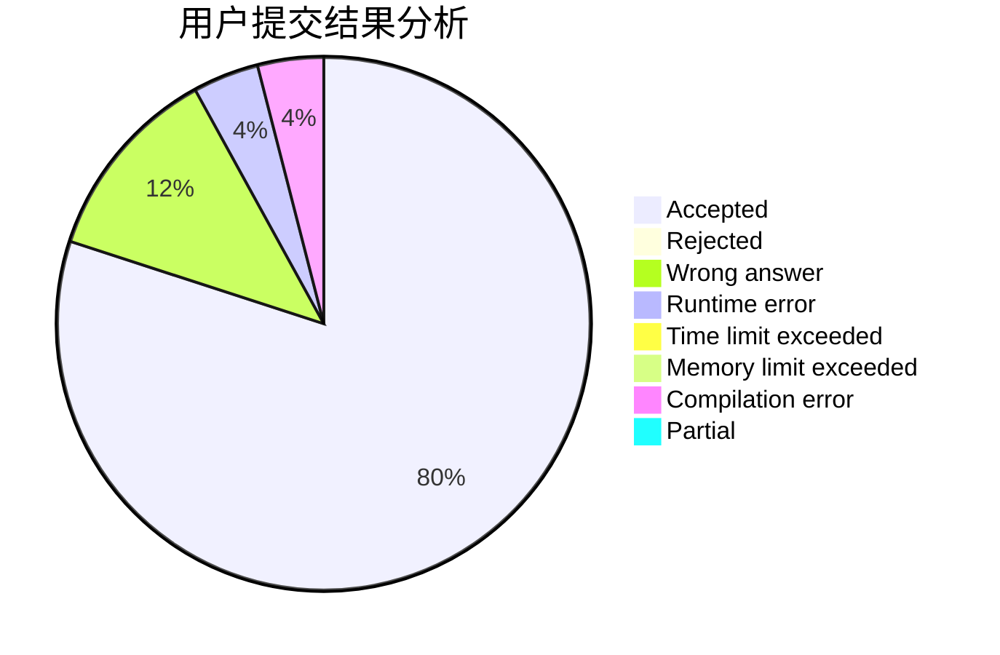
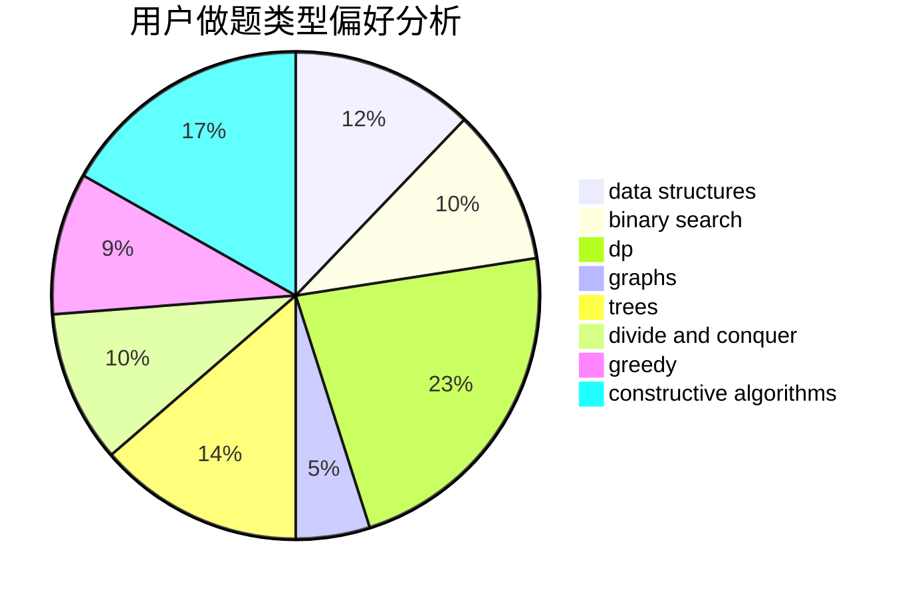
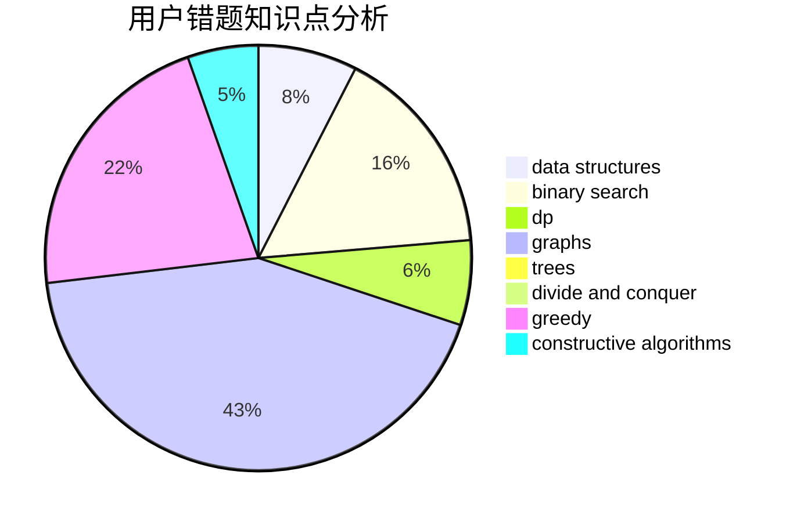

# new_lzr

<!-- tabs:start -->

#### **用户提交结果分析**

#### **用户做题类型偏好分析**

#### **用户错题知识点分析**

<!-- tabs:end -->
# 推荐题目
[702A](https://codeforces.com/contest/702/problem/A)		dp,
                        greedy,
                        implementation		  
[1417D](https://codeforces.com/contest/1417/problem/D)		dsu,graphs,sortings,trees		  
[691B](https://codeforces.com/contest/691/problem/B)		implementation,
                        strings		  
[1055F](https://codeforces.com/contest/1055/problem/F)		strings,
                        trees		  
[837C](https://codeforces.com/contest/837/problem/C)		brute force,
                        implementation		  
[1164Q](https://codeforces.com/contest/1164/problem/Q)		dsu,graphs,sortings,trees		  
[1333D](https://codeforces.com/contest/1333/problem/D)		brute force,
                        constructive algorithms,
                        games,
                        graphs,
                        greedy,
                        implementation,
                        sortings		  
[1145A](https://codeforces.com/contest/1145/problem/A)		implementation		  
[607E](https://codeforces.com/contest/607/problem/E)		binary search,
                        geometry		  
[707C](https://codeforces.com/contest/707/problem/C)		math,
                        number theory		  
