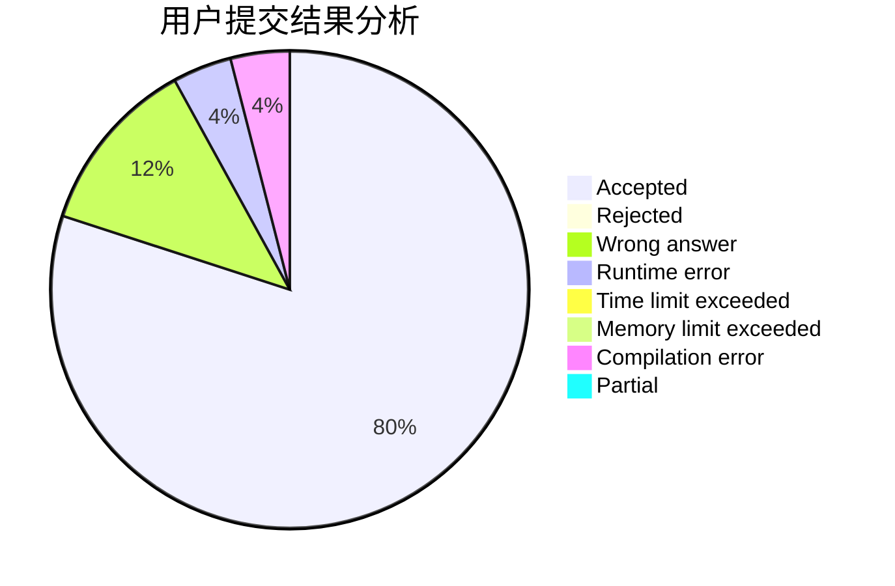
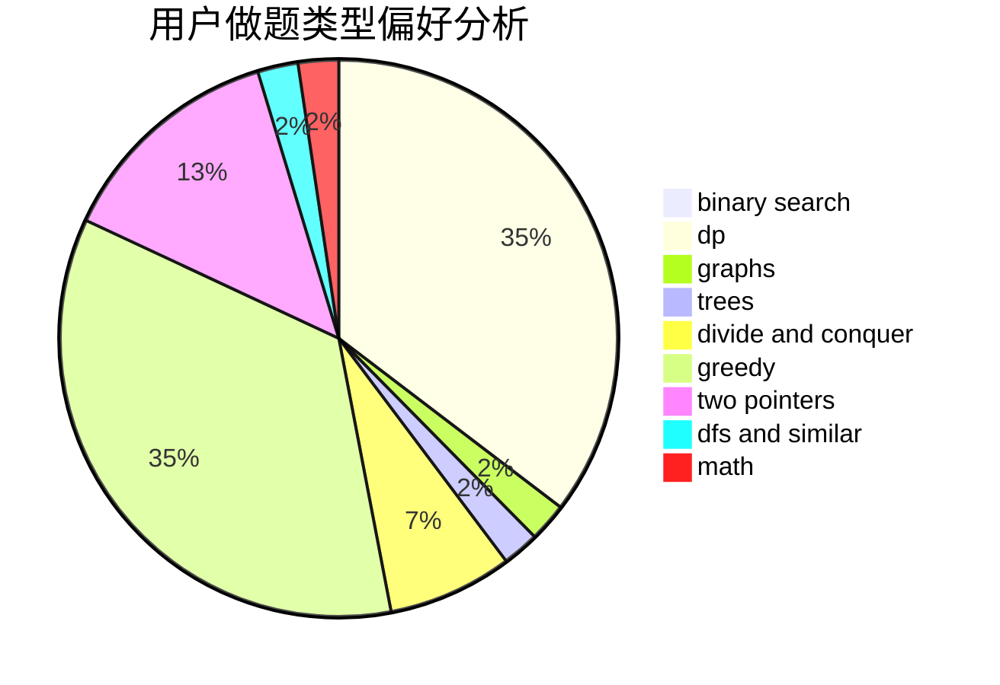

# new_lzr

<!-- tabs:start -->

#### **用户提交结果分析**

#### **用户做题类型偏好分析**

<!-- tabs:end -->
# 推荐题目
[720D](https://codeforces.com/contest/720/problem/D)
[1425A](https://codeforces.com/contest/1425/problem/A)
[710F](https://codeforces.com/contest/710/problem/F)
[1056C](https://codeforces.com/contest/1056/problem/C)
[854C](https://codeforces.com/contest/854/problem/C)
[1167A](https://codeforces.com/contest/1167/problem/A)
[1340C](https://codeforces.com/contest/1340/problem/C)
[1147B](https://codeforces.com/contest/1147/problem/B)
[626F](https://codeforces.com/contest/626/problem/F)
[725E](https://codeforces.com/contest/725/problem/E)
