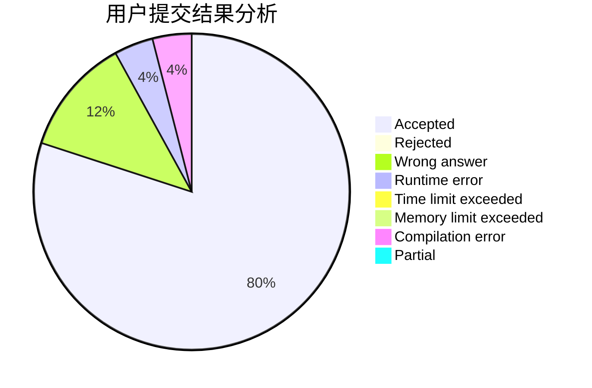
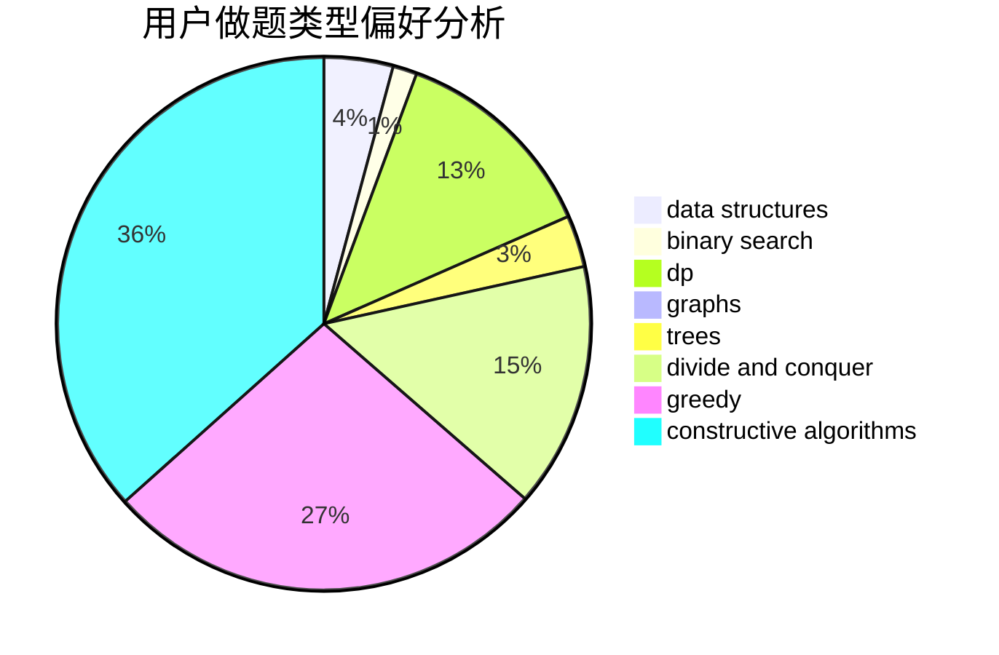

# new_lzr

<!-- tabs:start -->

#### **用户提交结果分析**

#### **用户做题类型偏好分析**

#### **用户错题知识点分析**

<!-- tabs:end -->
# 推荐题目
[720D](https://codeforces.com/contest/720/problem/D)		data structures,
                        dp,
                        sortings		  
[1425A](https://codeforces.com/contest/1425/problem/A)		games,
                        greedy		  
[710F](https://codeforces.com/contest/710/problem/F)		brute force,
                        data structures,
                        hashing,
                        interactive,
                        string suffix structures,
                        strings		  
[1056C](https://codeforces.com/contest/1056/problem/C)		greedy,
                        implementation,
                        interactive,
                        sortings		  
[854C](https://codeforces.com/contest/854/problem/C)		dsu,graphs,sortings,trees		  
[1167A](https://codeforces.com/contest/1167/problem/A)		brute force,
                        greedy,
                        strings		  
[1340C](https://codeforces.com/contest/1340/problem/C)		dfs and similar,
                        dp,
                        graphs,
                        shortest paths		  
[1147B](https://codeforces.com/contest/1147/problem/B)		brute force,
                        strings		  
[626F](https://codeforces.com/contest/626/problem/F)		dp		  
[725E](https://codeforces.com/contest/725/problem/E)		brute force,
                        greedy		  
