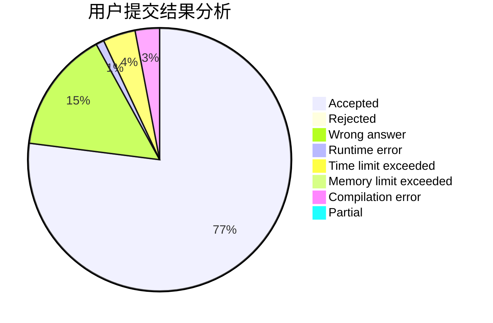
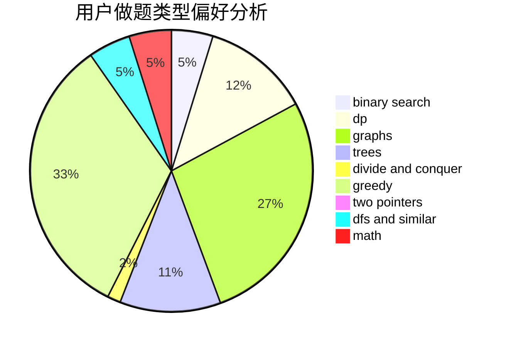

# newhar

<!-- tabs:start -->

#### **用户提交结果分析**

#### **用户做题类型偏好分析**

<!-- tabs:end -->
# 推荐题目
[938B](https://codeforces.com/contest/938/problem/B)
[963C](https://codeforces.com/contest/963/problem/C)
[396C](https://codeforces.com/contest/396/problem/C)
[20A](https://codeforces.com/contest/20/problem/A)
[784D](https://codeforces.com/contest/784/problem/D)
[127A](https://codeforces.com/contest/127/problem/A)
[1082F](https://codeforces.com/contest/1082/problem/F)
[150A](https://codeforces.com/contest/150/problem/A)
[347A](https://codeforces.com/contest/347/problem/A)
[1249F](https://codeforces.com/contest/1249/problem/F)
