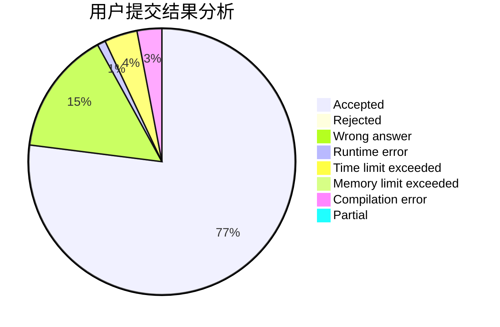
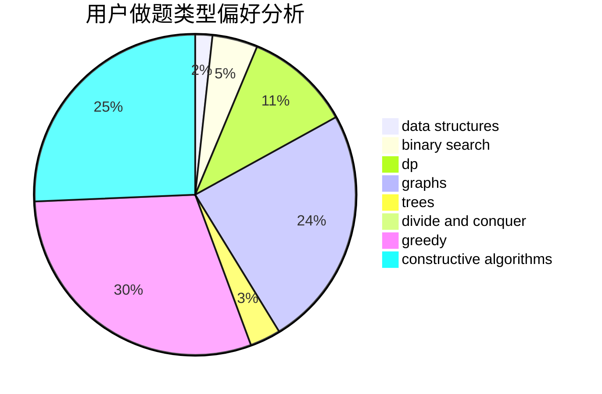
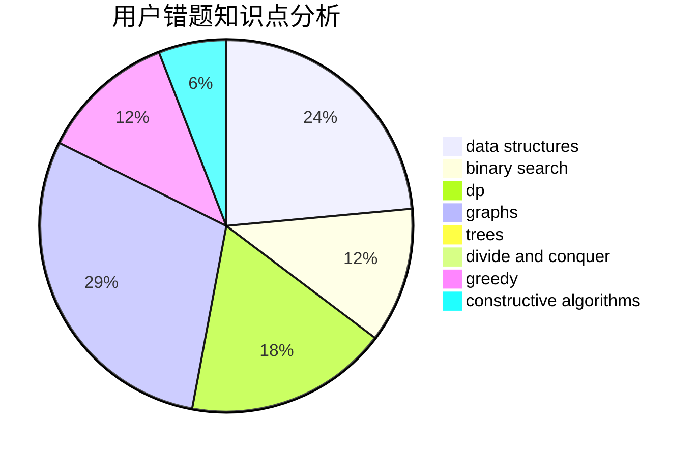

# newhar

<!-- tabs:start -->

#### **用户提交结果分析**

#### **用户做题类型偏好分析**

#### **用户错题知识点分析**

<!-- tabs:end -->
# 推荐题目
[938B](https://codeforces.com/contest/938/problem/B)		brute force,
                        greedy		  
[963C](https://codeforces.com/contest/963/problem/C)		brute force,
                        math,
                        number theory		  
[396C](https://codeforces.com/contest/396/problem/C)		data structures,
                        graphs,
                        trees		  
[20A](https://codeforces.com/contest/20/problem/A)		implementation		  
[784D](https://codeforces.com/contest/784/problem/D)		*special problem,
                        implementation		  
[127A](https://codeforces.com/contest/127/problem/A)		geometry		  
[1082F](https://codeforces.com/contest/1082/problem/F)		dp,
                        strings,
                        trees		  
[150A](https://codeforces.com/contest/150/problem/A)		games,
                        math,
                        number theory		  
[347A](https://codeforces.com/contest/347/problem/A)		constructive algorithms,
                        implementation,
                        sortings		  
[1249F](https://codeforces.com/contest/1249/problem/F)		dp,
                        trees		  
