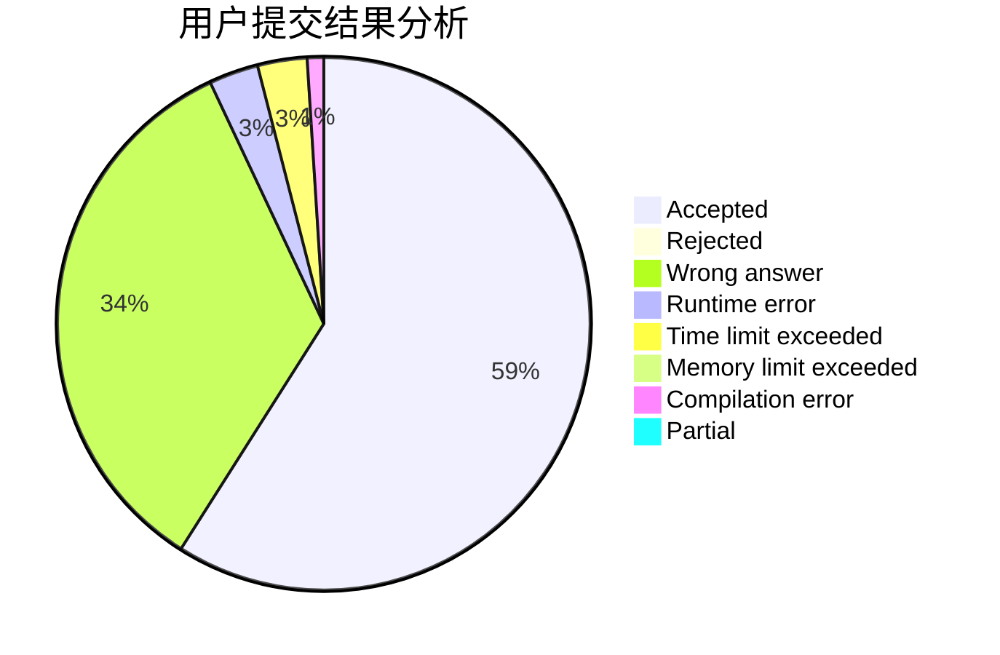
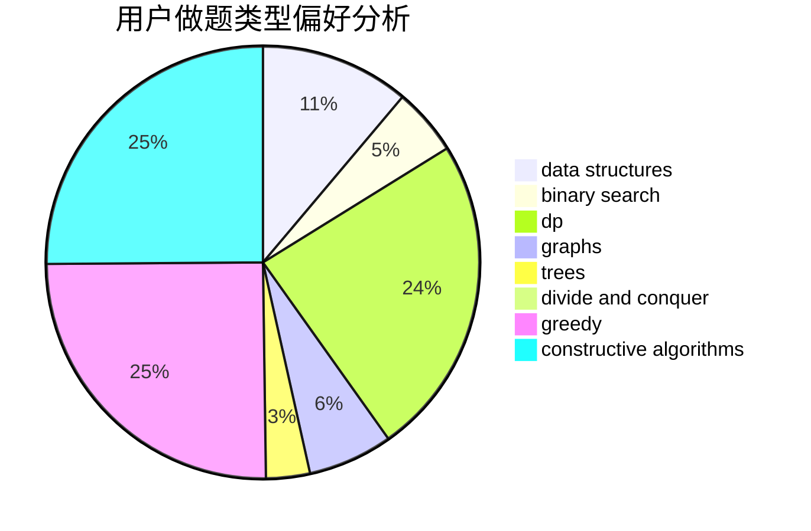
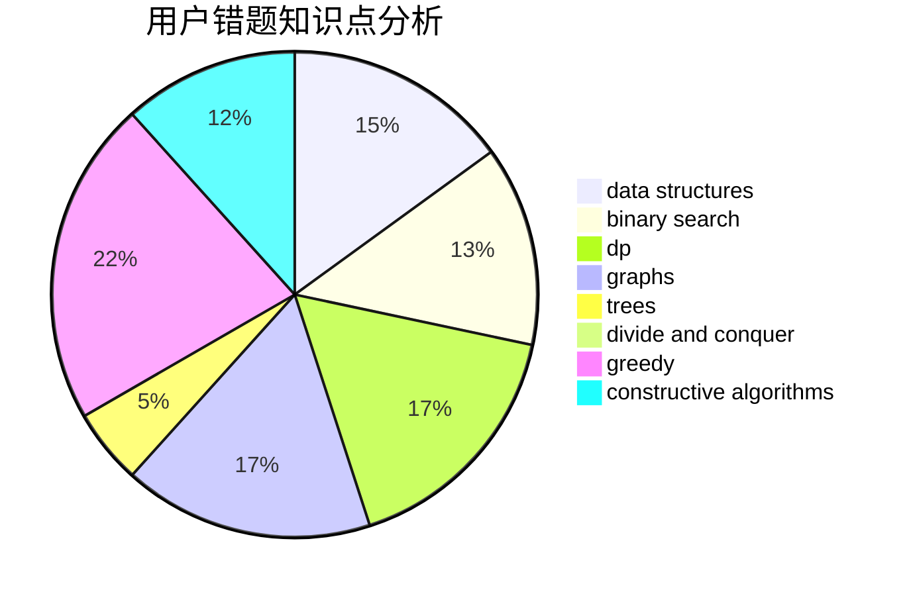

# nhc

<!-- tabs:start -->

#### **用户提交结果分析**

#### **用户做题类型偏好分析**

#### **用户错题知识点分析**

<!-- tabs:end -->
# 推荐题目
[1073A](https://codeforces.com/contest/1073/problem/A)		implementation,
                        strings		  
[97A](https://codeforces.com/contest/97/problem/A)		brute force,
                        implementation		  
[1290B](https://codeforces.com/contest/1290/problem/B)		binary search,
                        constructive algorithms,
                        data structures,
                        strings,
                        two pointers		  
[919E](https://codeforces.com/contest/919/problem/E)		chinese remainder theorem,
                        math,
                        number theory		  
[840A](https://codeforces.com/contest/840/problem/A)		combinatorics,
                        greedy,
                        math,
                        number theory,
                        sortings		  
[1205E](https://codeforces.com/contest/1205/problem/E)		combinatorics,
                        strings		  
[612C](https://codeforces.com/contest/612/problem/C)		data structures,
                        expression parsing,
                        math		  
[213E](https://codeforces.com/contest/213/problem/E)		data structures,
                        hashing,
                        strings		  
[407B](https://codeforces.com/contest/407/problem/B)		dp,
                        implementation		  
[515C](https://codeforces.com/contest/515/problem/C)		greedy,
                        math,
                        sortings		  
