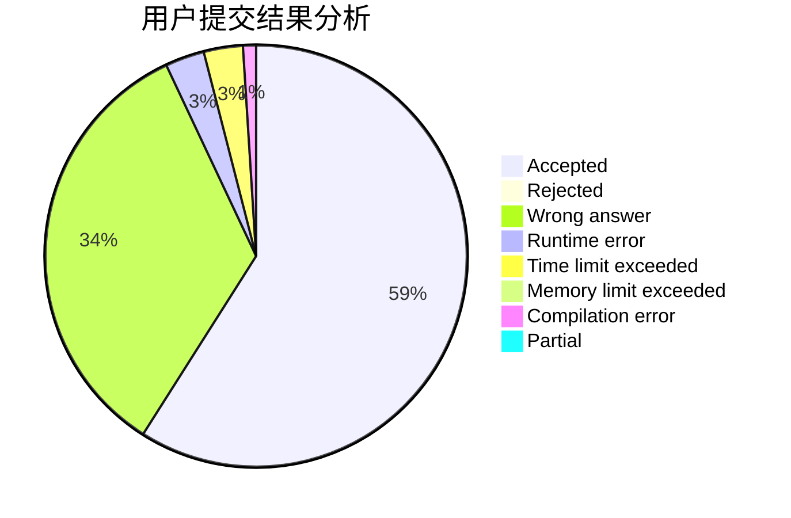
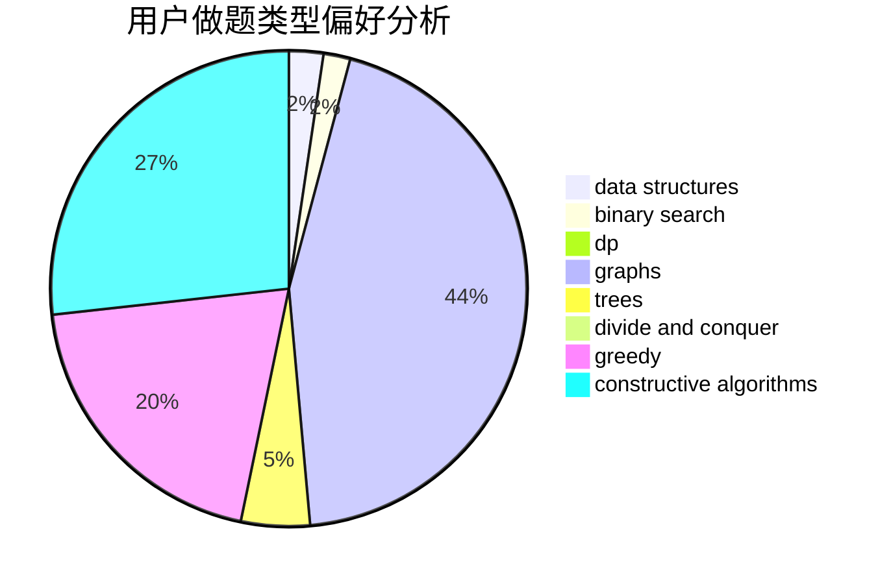
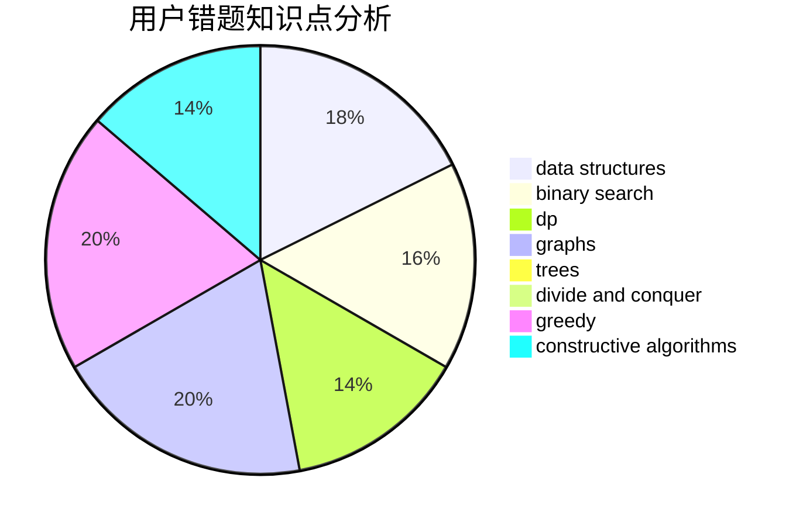

# nhc

<!-- tabs:start -->

#### **用户提交结果分析**

#### **用户做题类型偏好分析**

#### **用户错题知识点分析**

<!-- tabs:end -->
# 推荐题目
[1073D](https://codeforces.com/contest/1073/problem/D)		binary search,
                        brute force,
                        data structures,
                        greedy		  
[994A](https://codeforces.com/contest/994/problem/A)		implementation		  
[1296D](https://codeforces.com/contest/1296/problem/D)		greedy,
                        sortings		  
[939F](https://codeforces.com/contest/939/problem/F)		data structures,
                        dp		  
[859E](https://codeforces.com/contest/859/problem/E)		combinatorics,
                        dfs and similar,
                        dsu,
                        graphs,
                        trees		  
[120H](https://codeforces.com/contest/120/problem/H)		graph matchings		  
[631E](https://codeforces.com/contest/631/problem/E)		data structures,
                        dp,
                        geometry		  
[233A](https://codeforces.com/contest/233/problem/A)		implementation,
                        math		  
[436A](https://codeforces.com/contest/436/problem/A)		greedy		  
[542D](https://codeforces.com/contest/542/problem/D)		dfs and similar,
                        dp,
                        hashing,
                        math,
                        number theory		  
