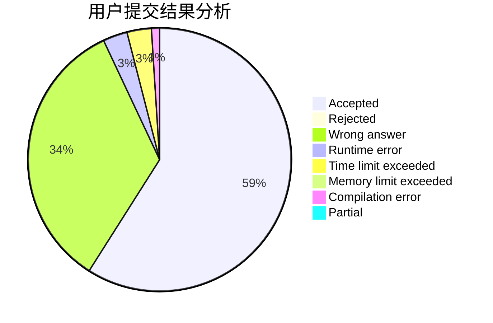
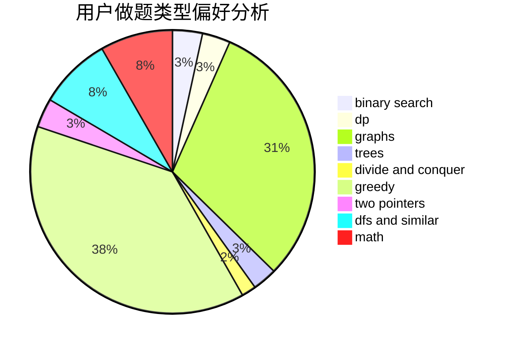

# nhc

<!-- tabs:start -->

#### **用户提交结果分析**

#### **用户做题类型偏好分析**

<!-- tabs:end -->
# 推荐题目
[1073D](https://codeforces.com/contest/1073/problem/D)
[994A](https://codeforces.com/contest/994/problem/A)
[1296D](https://codeforces.com/contest/1296/problem/D)
[939F](https://codeforces.com/contest/939/problem/F)
[859E](https://codeforces.com/contest/859/problem/E)
[120H](https://codeforces.com/contest/120/problem/H)
[631E](https://codeforces.com/contest/631/problem/E)
[233A](https://codeforces.com/contest/233/problem/A)
[436A](https://codeforces.com/contest/436/problem/A)
[542D](https://codeforces.com/contest/542/problem/D)
