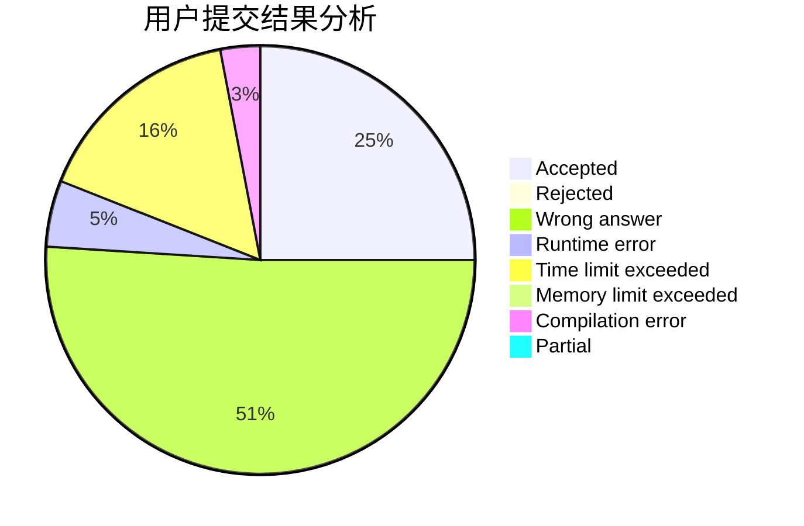
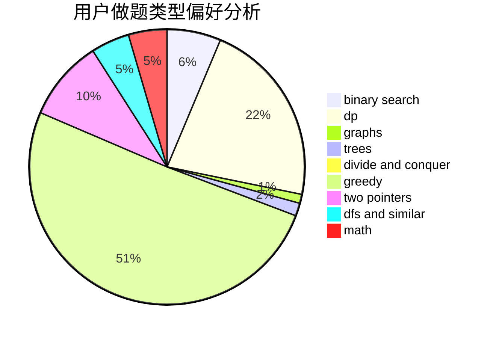

# niiii

<!-- tabs:start -->

#### **用户提交结果分析**

#### **用户做题类型偏好分析**

<!-- tabs:end -->
# 推荐题目
[1405B](https://codeforces.com/contest/1405/problem/B)
[1182C](https://codeforces.com/contest/1182/problem/C)
[1142D](https://codeforces.com/contest/1142/problem/D)
[975A](https://codeforces.com/contest/975/problem/A)
[732B](https://codeforces.com/contest/732/problem/B)
[446D](https://codeforces.com/contest/446/problem/D)
[799F](https://codeforces.com/contest/799/problem/F)
[278B](https://codeforces.com/contest/278/problem/B)
[93C](https://codeforces.com/contest/93/problem/C)
[429C](https://codeforces.com/contest/429/problem/C)
