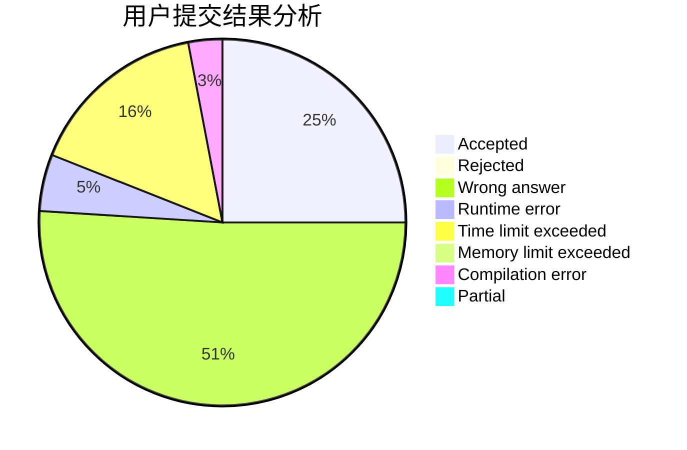
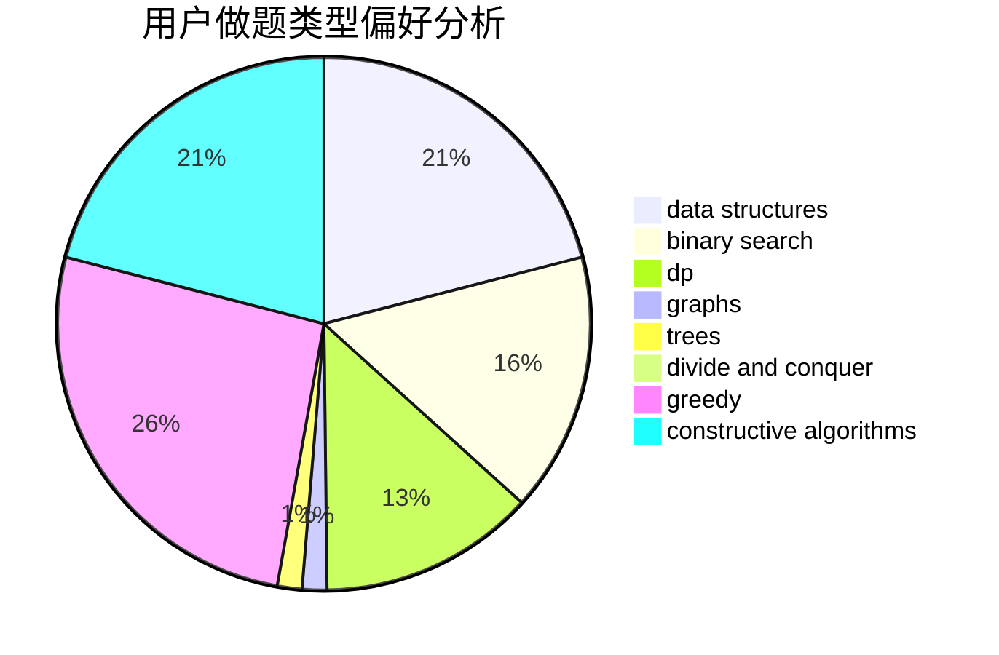
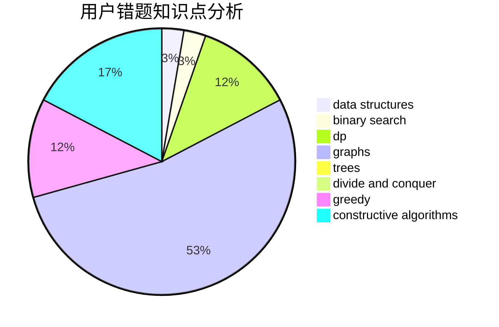

# niiii

<!-- tabs:start -->

#### **用户提交结果分析**

#### **用户做题类型偏好分析**

#### **用户错题知识点分析**

<!-- tabs:end -->
# 推荐题目
[1405B](https://codeforces.com/contest/1405/problem/B)		constructive algorithms,
                        implementation		  
[1182C](https://codeforces.com/contest/1182/problem/C)		data structures,
                        greedy,
                        strings		  
[1142D](https://codeforces.com/contest/1142/problem/D)		dp		  
[975A](https://codeforces.com/contest/975/problem/A)		implementation,
                        strings		  
[732B](https://codeforces.com/contest/732/problem/B)		dp,
                        greedy		  
[446D](https://codeforces.com/contest/446/problem/D)		math,
                        matrices,
                        probabilities		  
[799F](https://codeforces.com/contest/799/problem/F)		data structures		  
[278B](https://codeforces.com/contest/278/problem/B)		brute force,
                        strings		  
[93C](https://codeforces.com/contest/93/problem/C)		brute force,
                        implementation		  
[429C](https://codeforces.com/contest/429/problem/C)		bitmasks,
                        constructive algorithms,
                        dp,
                        greedy,
                        trees		  
