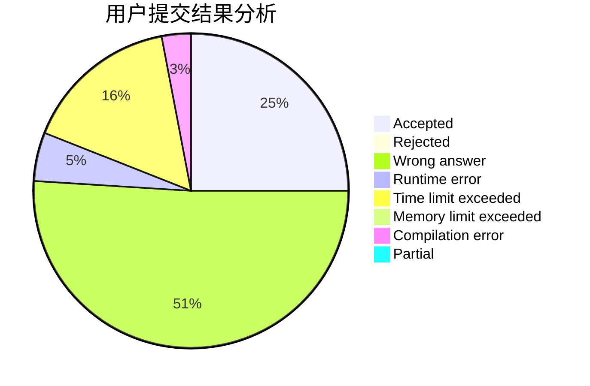
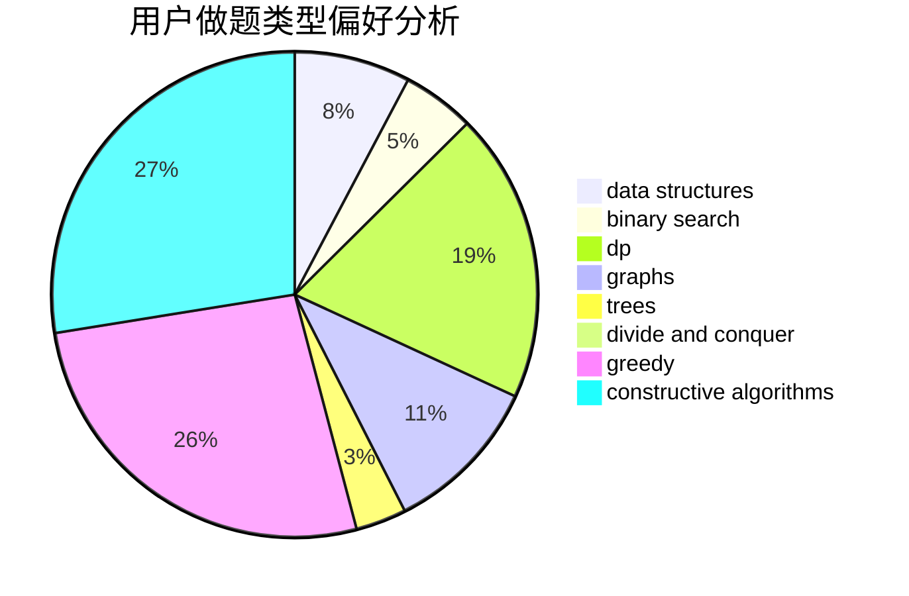
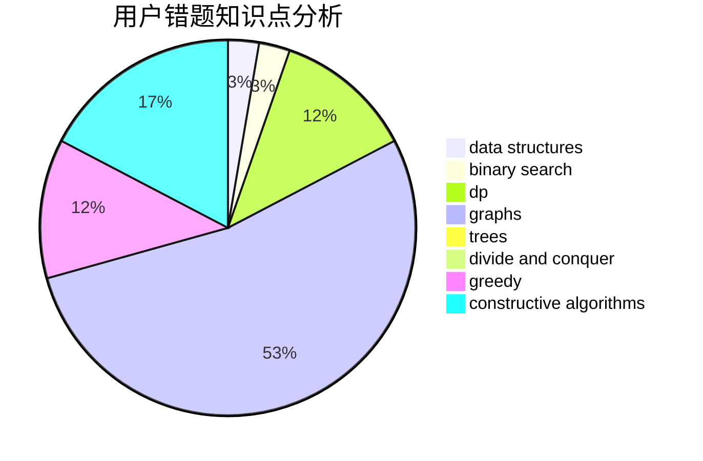

# niiii

<!-- tabs:start -->

#### **用户提交结果分析**

#### **用户做题类型偏好分析**

#### **用户错题知识点分析**

<!-- tabs:end -->
# 推荐题目
[1396C](https://codeforces.com/contest/1396/problem/C)		dp,
                        greedy,
                        implementation		  
[1179D](https://codeforces.com/contest/1179/problem/D)		data structures,
                        dp,
                        trees		  
[1140F](https://codeforces.com/contest/1140/problem/F)		data structures,
                        divide and conquer,
                        dsu		  
[952B](https://codeforces.com/contest/952/problem/B)		brute force,
                        interactive		  
[713A](https://codeforces.com/contest/713/problem/A)		data structures,
                        implementation		  
[421B](https://codeforces.com/contest/421/problem/B)		dsu,graphs,sortings,trees		  
[780G](https://codeforces.com/contest/780/problem/G)		data structures,
                        dp		  
[260A](https://codeforces.com/contest/260/problem/A)		implementation,
                        math		  
[91A](https://codeforces.com/contest/91/problem/A)		greedy,
                        strings		  
[3B](https://codeforces.com/contest/3/problem/B)		greedy,
                        sortings		  
