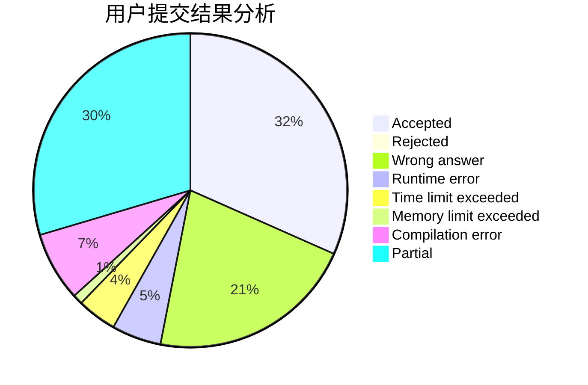
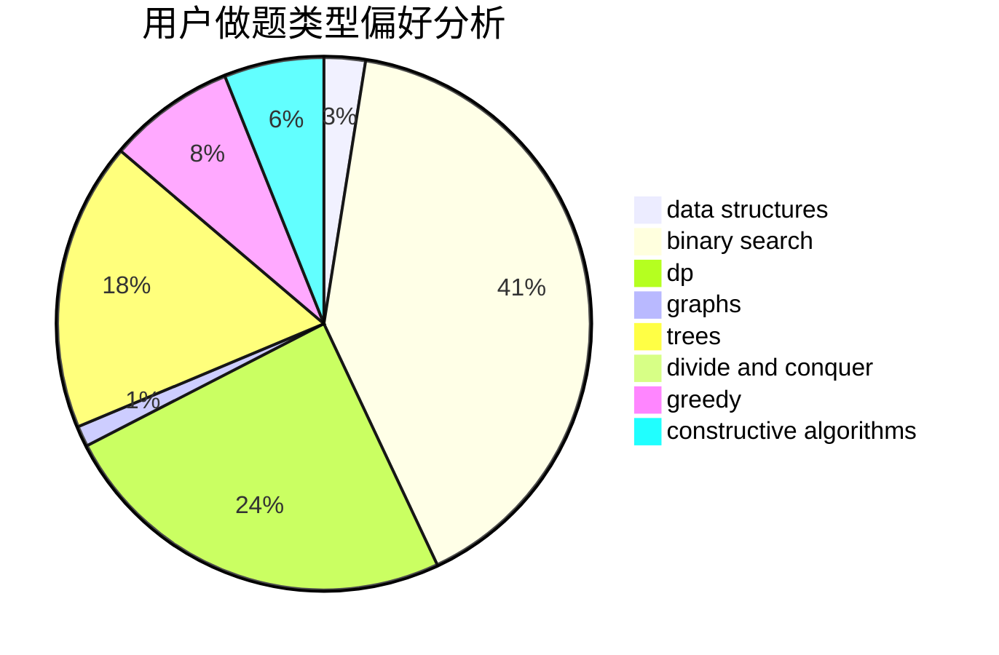

# niike0goood

<!-- tabs:start -->

#### **用户提交结果分析**

#### **用户做题类型偏好分析**

#### **用户错题知识点分析**

<!-- tabs:end -->
# 推荐题目
[388B](https://codeforces.com/contest/388/problem/B)		bitmasks,
                        constructive algorithms,
                        graphs,
                        implementation,
                        math		  
[724C](https://codeforces.com/contest/724/problem/C)		greedy,
                        hashing,
                        implementation,
                        math,
                        number theory,
                        sortings		  
[424B](https://codeforces.com/contest/424/problem/B)		binary search,
                        greedy,
                        implementation,
                        sortings		  
[1293E](https://codeforces.com/contest/1293/problem/E)		dsu,graphs,sortings,trees		  
[721E](https://codeforces.com/contest/721/problem/E)		binary search,
                        dp		  
[853D](https://codeforces.com/contest/853/problem/D)		binary search,
                        dp,
                        greedy		  
[1008C](https://codeforces.com/contest/1008/problem/C)		dsu,graphs,sortings,trees		  
[802D](https://codeforces.com/contest/802/problem/D)		math		  
[479E](https://codeforces.com/contest/479/problem/E)		combinatorics,
                        dp		  
[439C](https://codeforces.com/contest/439/problem/C)		brute force,
                        constructive algorithms,
                        implementation,
                        number theory		  
