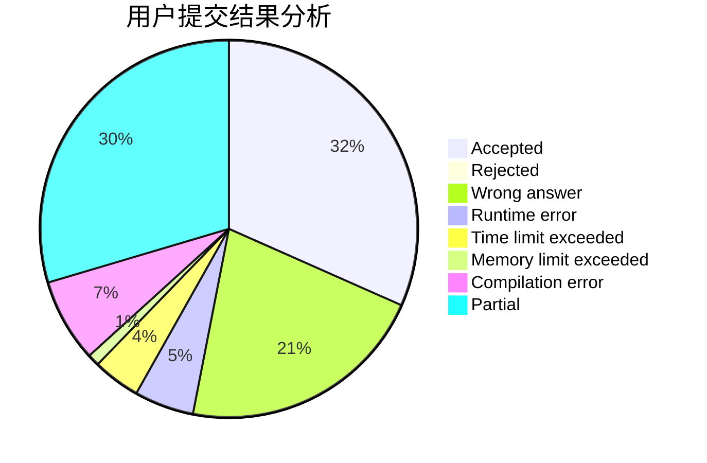
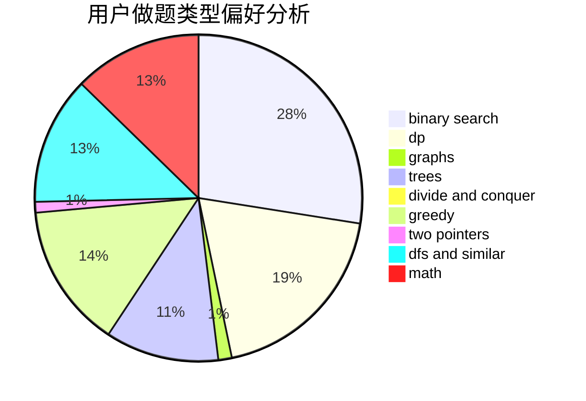

# niike0goood

<!-- tabs:start -->

#### **用户提交结果分析**

#### **用户做题类型偏好分析**

<!-- tabs:end -->
# 推荐题目
[388B](https://codeforces.com/contest/388/problem/B)
[724C](https://codeforces.com/contest/724/problem/C)
[424B](https://codeforces.com/contest/424/problem/B)
[1293E](https://codeforces.com/contest/1293/problem/E)
[721E](https://codeforces.com/contest/721/problem/E)
[853D](https://codeforces.com/contest/853/problem/D)
[1008C](https://codeforces.com/contest/1008/problem/C)
[802D](https://codeforces.com/contest/802/problem/D)
[479E](https://codeforces.com/contest/479/problem/E)
[439C](https://codeforces.com/contest/439/problem/C)
