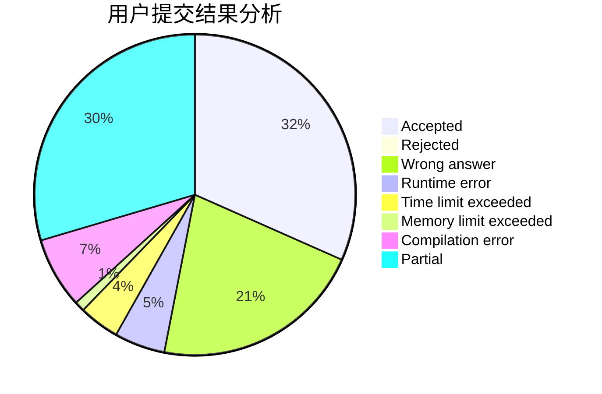
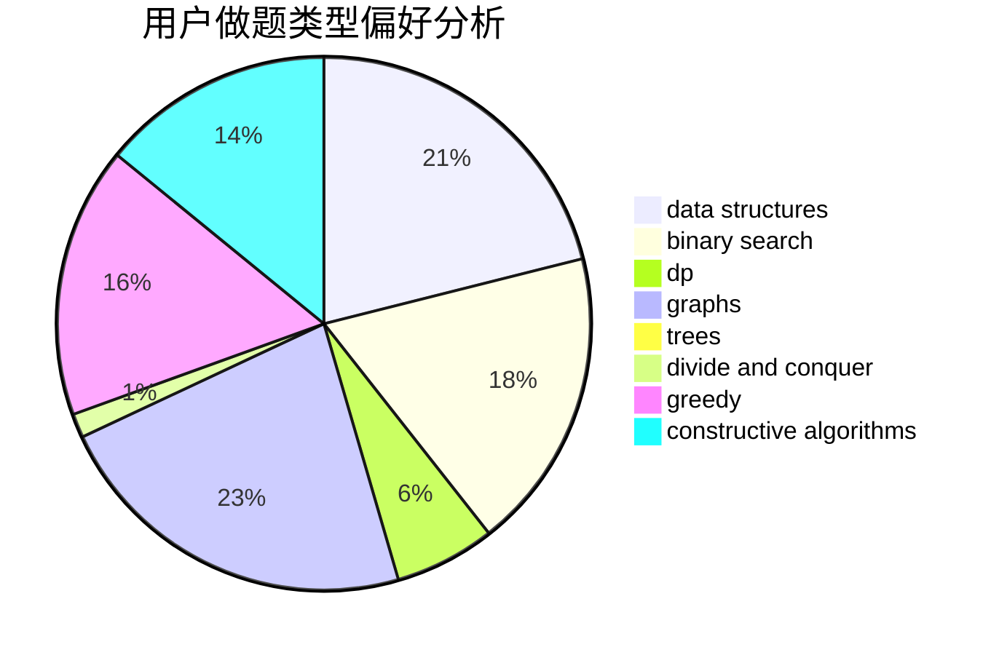

# niike0goood

<!-- tabs:start -->

#### **用户提交结果分析**

#### **用户做题类型偏好分析**

#### **用户错题知识点分析**

<!-- tabs:end -->
# 推荐题目
[360A](https://codeforces.com/contest/360/problem/A)		greedy,
                        implementation		  
[705B](https://codeforces.com/contest/705/problem/B)		games,
                        math		  
[396C](https://codeforces.com/contest/396/problem/C)		data structures,
                        graphs,
                        trees		  
[1286C2](https://codeforces.com/contest/1286C/problem/2)		brute force,
                        constructive algorithms,
                        hashing,
                        interactive,
                        math		  
[703A](https://codeforces.com/contest/703/problem/A)		implementation		  
[835F](https://codeforces.com/contest/835/problem/F)		dfs and similar,
                        dp,
                        graphs,
                        trees		  
[1007E](https://codeforces.com/contest/1007/problem/E)		dp		  
[785A](https://codeforces.com/contest/785/problem/A)		implementation,
                        strings		  
[460B](https://codeforces.com/contest/460/problem/B)		brute force,
                        implementation,
                        math,
                        number theory		  
[413E](https://codeforces.com/contest/413/problem/E)		data structures,
                        divide and conquer		  
