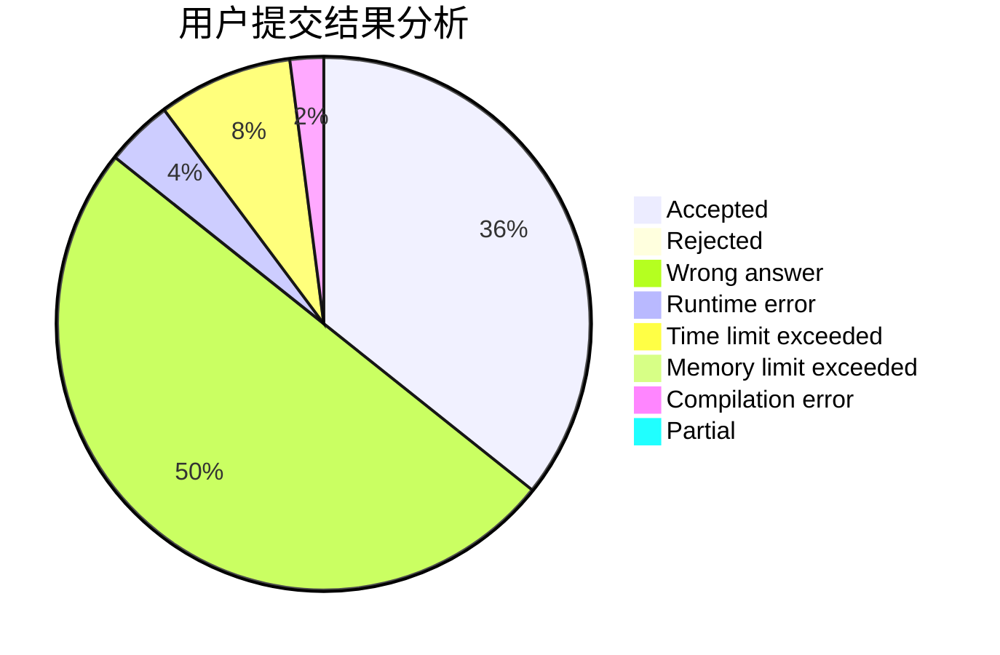
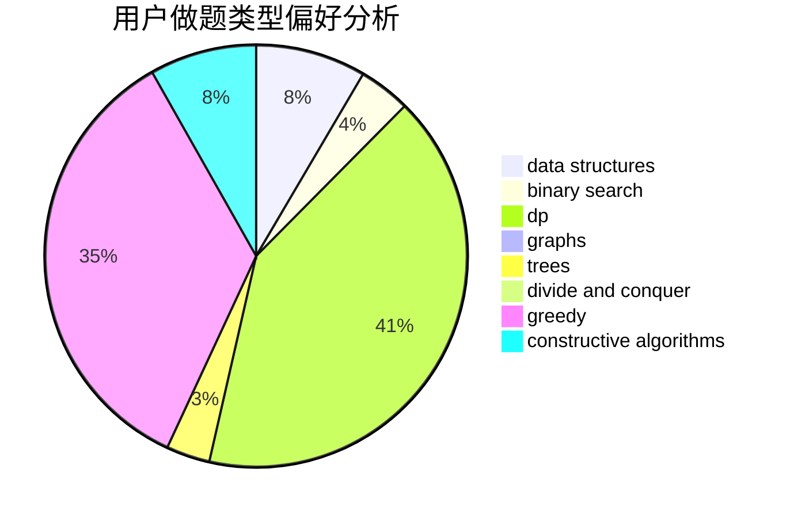
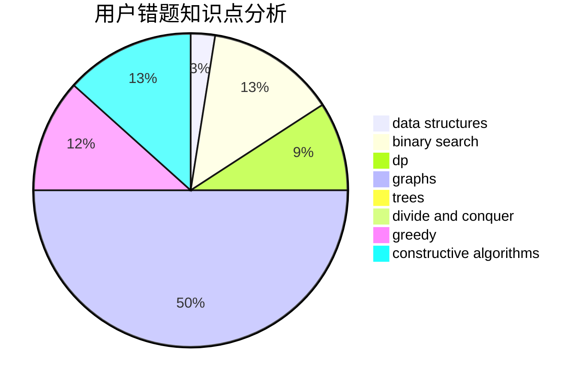

# ningBr

<!-- tabs:start -->

#### **用户提交结果分析**

#### **用户做题类型偏好分析**

#### **用户错题知识点分析**

<!-- tabs:end -->
# 推荐题目
[1399D](https://codeforces.com/contest/1399/problem/D)		constructive algorithms,
                        data structures,
                        greedy,
                        implementation		  
[956F](https://codeforces.com/contest/956/problem/F)		dsu,graphs,sortings,trees		  
[318A](https://codeforces.com/contest/318/problem/A)		math		  
[484A](https://codeforces.com/contest/484/problem/A)		bitmasks,
                        constructive algorithms		  
[1360D](https://codeforces.com/contest/1360/problem/D)		math,
                        number theory		  
[346B](https://codeforces.com/contest/346/problem/B)		dp,
                        strings		  
[1413C](https://codeforces.com/contest/1413/problem/C)		binary search,
                        brute force,
                        dp,
                        implementation,
                        sortings,
                        two pointers		  
[1294A](https://codeforces.com/contest/1294/problem/A)		math		  
[749B](https://codeforces.com/contest/749/problem/B)		brute force,
                        constructive algorithms,
                        geometry		  
[1246F](https://codeforces.com/contest/1246/problem/F)		nan		  
