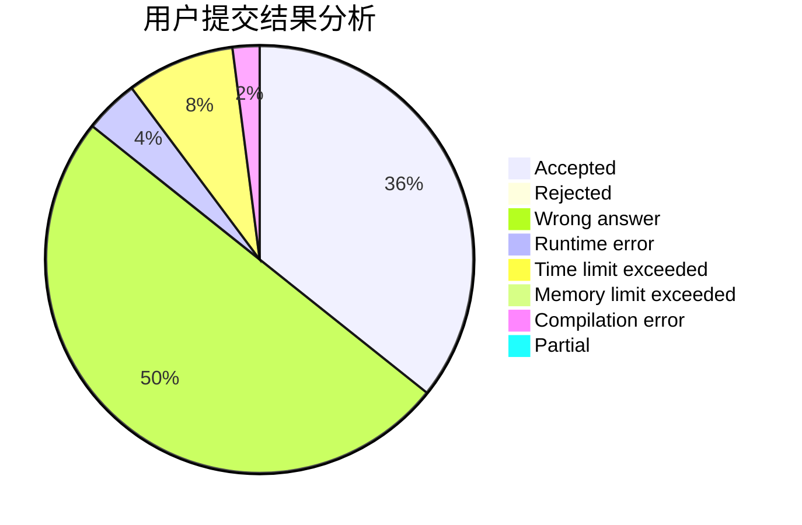
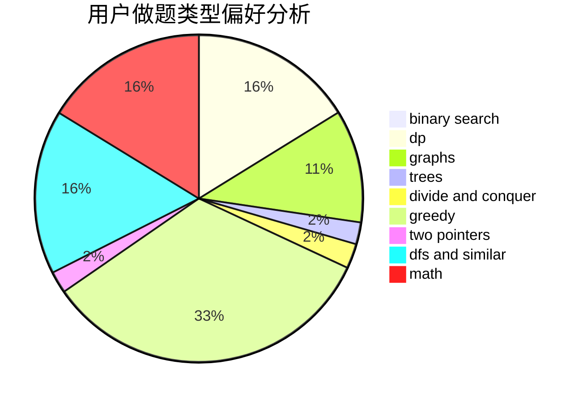

# ningBr

<!-- tabs:start -->

#### **用户提交结果分析**

#### **用户做题类型偏好分析**

<!-- tabs:end -->
# 推荐题目
[1408E](https://codeforces.com/contest/1408/problem/E)
[978C](https://codeforces.com/contest/978/problem/C)
[348B](https://codeforces.com/contest/348/problem/B)
[505B](https://codeforces.com/contest/505/problem/B)
[1368C](https://codeforces.com/contest/1368/problem/C)
[371E](https://codeforces.com/contest/371/problem/E)
[1422E](https://codeforces.com/contest/1422/problem/E)
[1300C](https://codeforces.com/contest/1300/problem/C)
[768B](https://codeforces.com/contest/768/problem/B)
[1250N](https://codeforces.com/contest/1250/problem/N)
