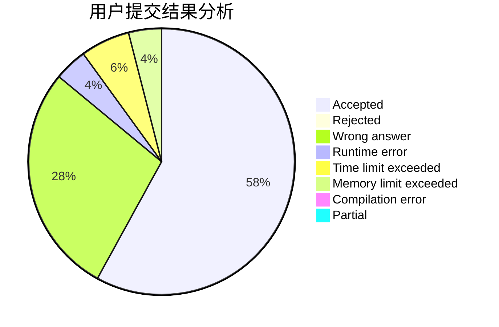
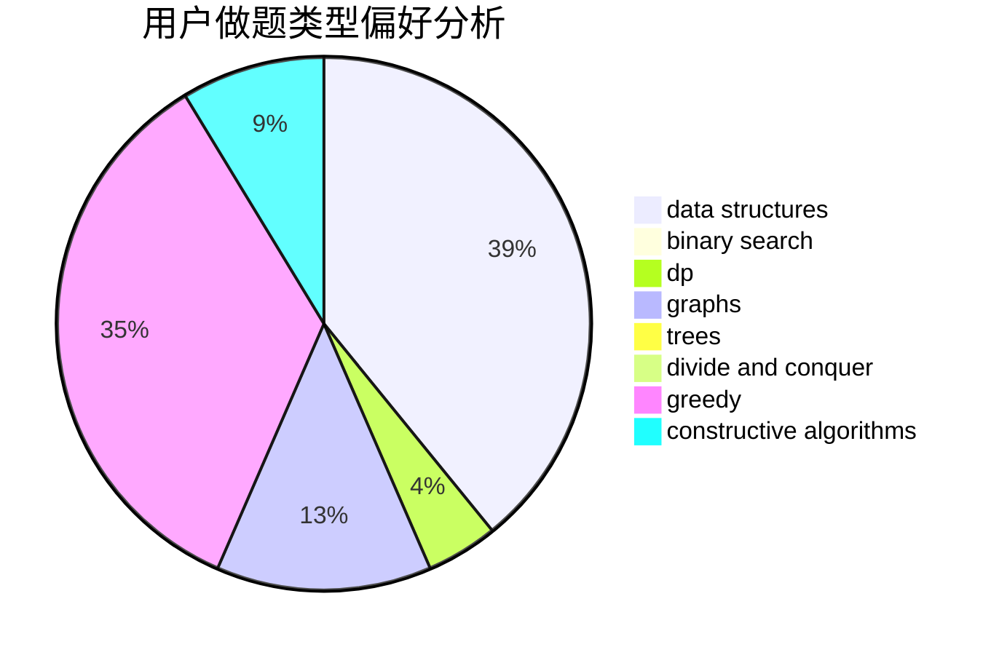
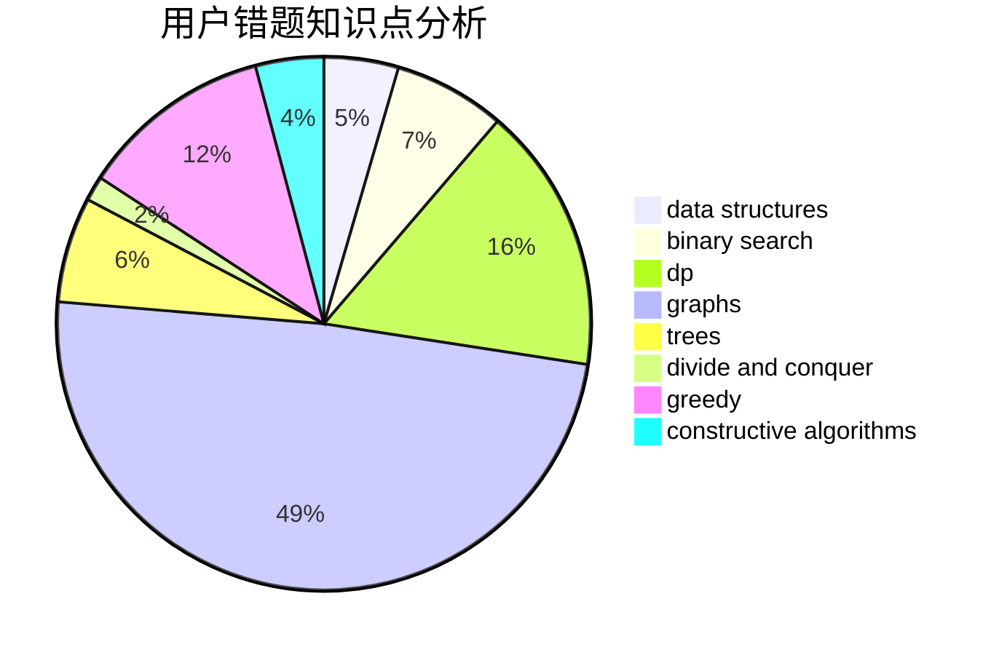

# niujie

<!-- tabs:start -->

#### **用户提交结果分析**

#### **用户做题类型偏好分析**

#### **用户错题知识点分析**

<!-- tabs:end -->
# 推荐题目
[1346F](https://codeforces.com/contest/1346/problem/F)		*special problem,
                        data structures,
                        greedy,
                        math		  
[801C](https://codeforces.com/contest/801/problem/C)		dsu,graphs,sortings,trees		  
[1151B](https://codeforces.com/contest/1151/problem/B)		bitmasks,
                        brute force,
                        constructive algorithms,
                        dp		  
[812B](https://codeforces.com/contest/812/problem/B)		bitmasks,
                        brute force,
                        dp		  
[1498E](https://codeforces.com/contest/1498/problem/E)		brute force,
                        graphs,
                        greedy,
                        interactive,
                        sortings		  
[1427D](https://codeforces.com/contest/1427/problem/D)		constructive algorithms,
                        implementation		  
[1490C](https://codeforces.com/contest/1490/problem/C)		binary search,
                        brute force,
                        brute force,
                        math		  
[1497B](https://codeforces.com/contest/1497/problem/B)		constructive algorithms,
                        greedy,
                        math		  
[1491C](https://codeforces.com/contest/1491/problem/C)		brute force,
                        data structures,
                        dp,
                        greedy,
                        implementation		  
[1484C](https://codeforces.com/contest/1484/problem/C)		dsu,graphs,sortings,trees		  
