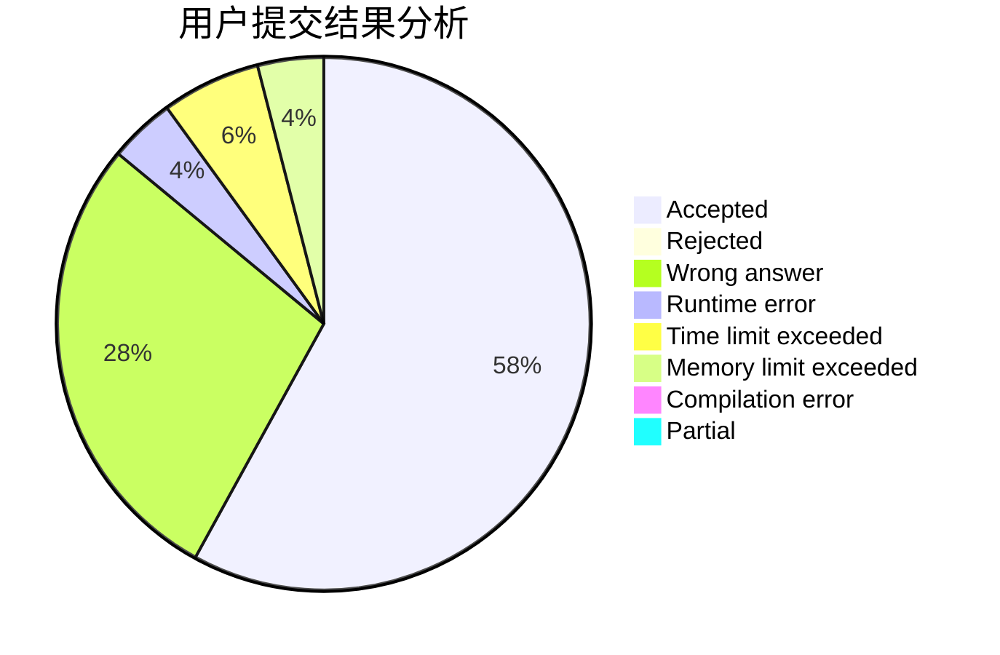
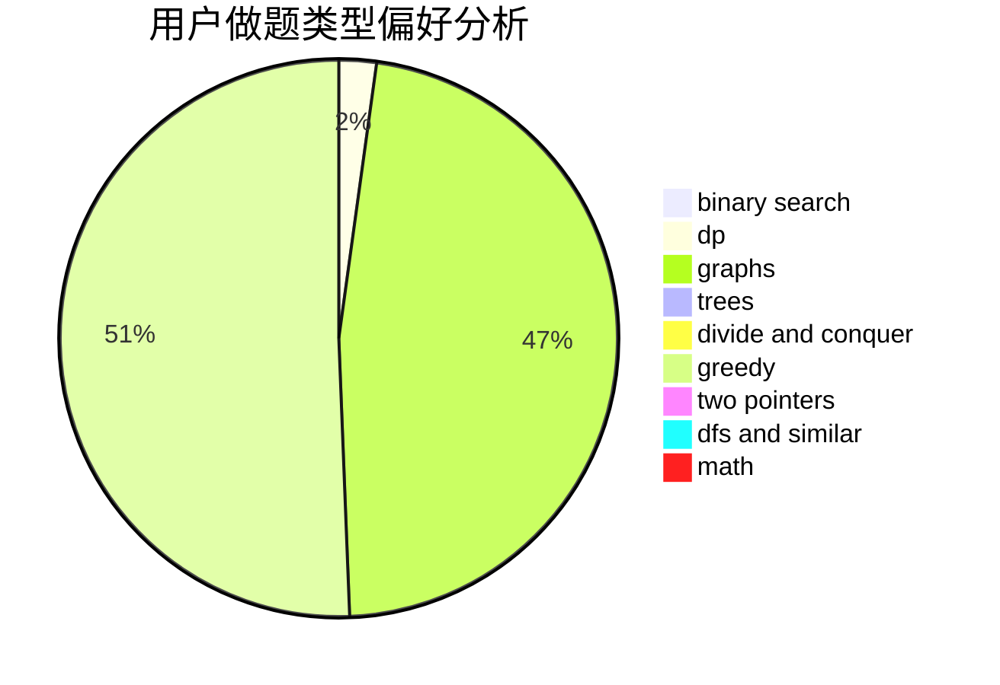

# niujie

<!-- tabs:start -->

#### **用户提交结果分析**

#### **用户做题类型偏好分析**

<!-- tabs:end -->
# 推荐题目
[1346F](https://codeforces.com/contest/1346/problem/F)
[801C](https://codeforces.com/contest/801/problem/C)
[1151B](https://codeforces.com/contest/1151/problem/B)
[812B](https://codeforces.com/contest/812/problem/B)
[1498E](https://codeforces.com/contest/1498/problem/E)
[1427D](https://codeforces.com/contest/1427/problem/D)
[1490C](https://codeforces.com/contest/1490/problem/C)
[1497B](https://codeforces.com/contest/1497/problem/B)
[1491C](https://codeforces.com/contest/1491/problem/C)
[1484C](https://codeforces.com/contest/1484/problem/C)
