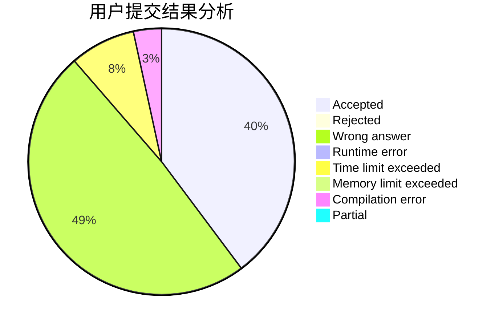
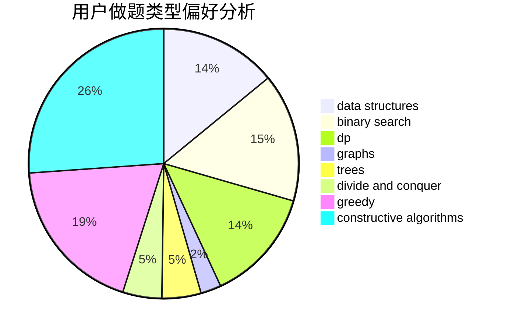
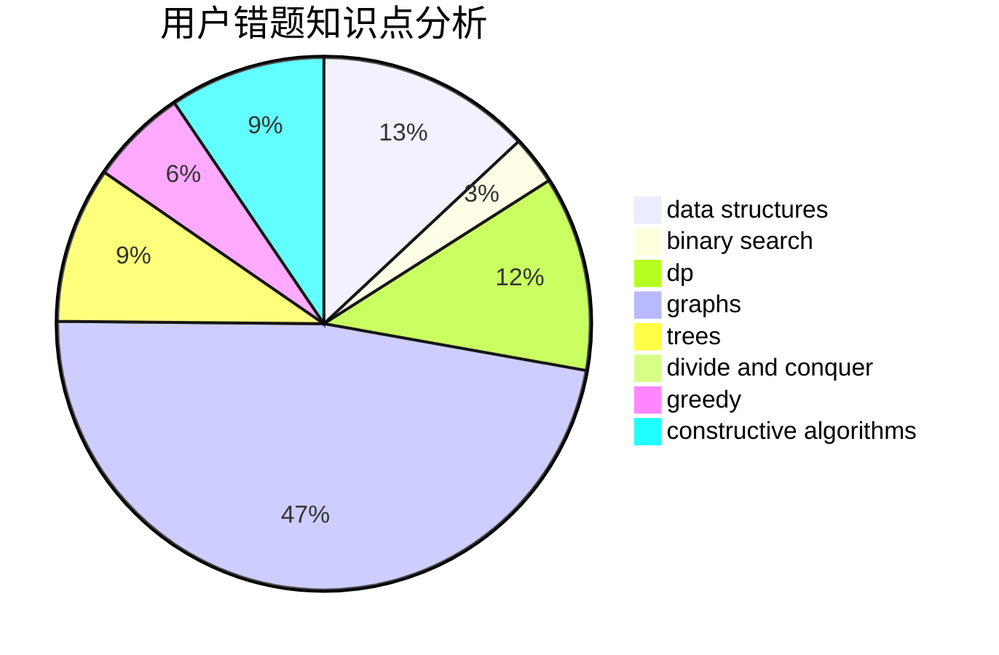

# niveton

<!-- tabs:start -->

#### **用户提交结果分析**

#### **用户做题类型偏好分析**

#### **用户错题知识点分析**

<!-- tabs:end -->
# 推荐题目
[702E](https://codeforces.com/contest/702/problem/E)		data structures,
                        graphs		  
[838C](https://codeforces.com/contest/838/problem/C)		dp,
                        games		  
[846C](https://codeforces.com/contest/846/problem/C)		brute force,
                        data structures,
                        dp		  
[527B](https://codeforces.com/contest/527/problem/B)		greedy		  
[710B](https://codeforces.com/contest/710/problem/B)		brute force,
                        sortings		  
[599E](https://codeforces.com/contest/599/problem/E)		bitmasks,
                        dp,
                        trees		  
[871D](https://codeforces.com/contest/871/problem/D)		dsu,graphs,sortings,trees		  
[1183C](https://codeforces.com/contest/1183/problem/C)		binary search,
                        math		  
[1011E](https://codeforces.com/contest/1011/problem/E)		dsu,graphs,sortings,trees		  
[1322E](https://codeforces.com/contest/1322/problem/E)		data structures		  
