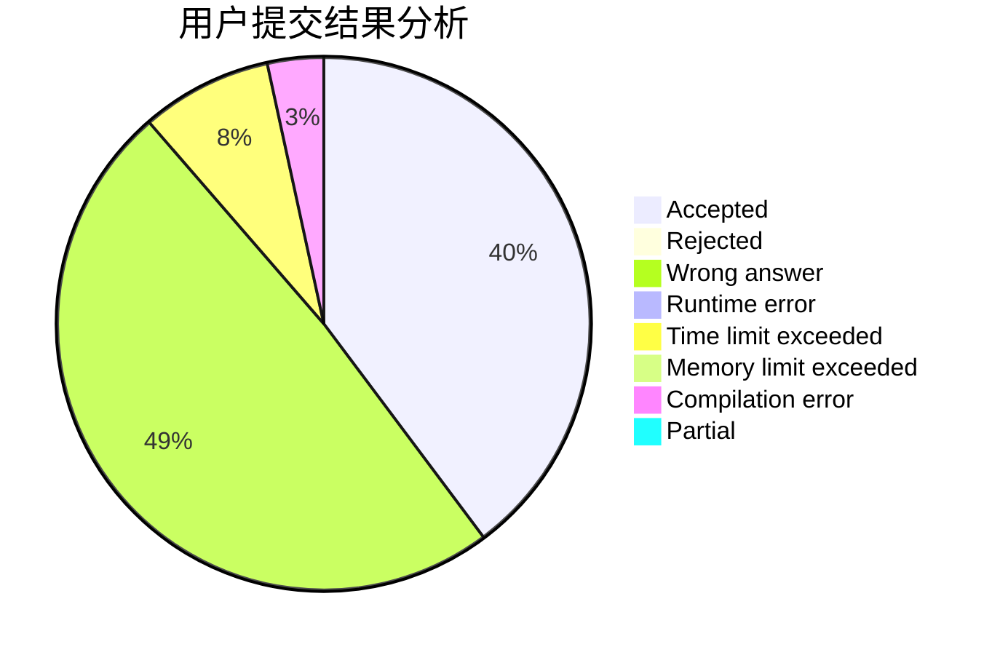
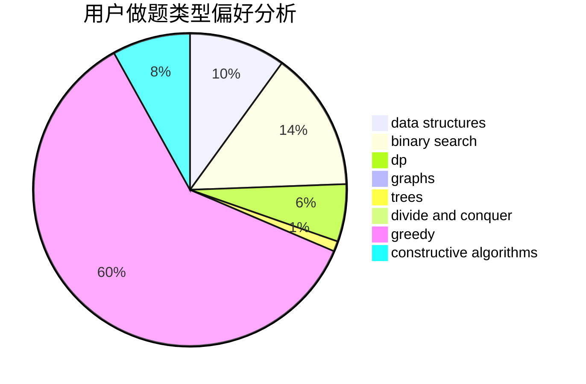

# niveton

<!-- tabs:start -->

#### **用户提交结果分析**

#### **用户做题类型偏好分析**

#### **用户错题知识点分析**

<!-- tabs:end -->
# 推荐题目
[721C](https://codeforces.com/contest/721/problem/C)		dp,
                        graphs		  
[856C](https://codeforces.com/contest/856/problem/C)		combinatorics,
                        dp,
                        math		  
[864E](https://codeforces.com/contest/864/problem/E)		dp,
                        sortings		  
[551B](https://codeforces.com/contest/551/problem/B)		brute force,
                        constructive algorithms,
                        implementation,
                        strings		  
[730E](https://codeforces.com/contest/730/problem/E)		greedy,
                        implementation		  
[618A](https://codeforces.com/contest/618/problem/A)		implementation		  
[893A](https://codeforces.com/contest/893/problem/A)		implementation		  
[1185F](https://codeforces.com/contest/1185/problem/F)		bitmasks,
                        brute force		  
[1012B](https://codeforces.com/contest/1012/problem/B)		constructive algorithms,
                        dfs and similar,
                        dsu,
                        graphs,
                        matrices		  
[1329D](https://codeforces.com/contest/1329/problem/D)		constructive algorithms,
                        data structures		  
