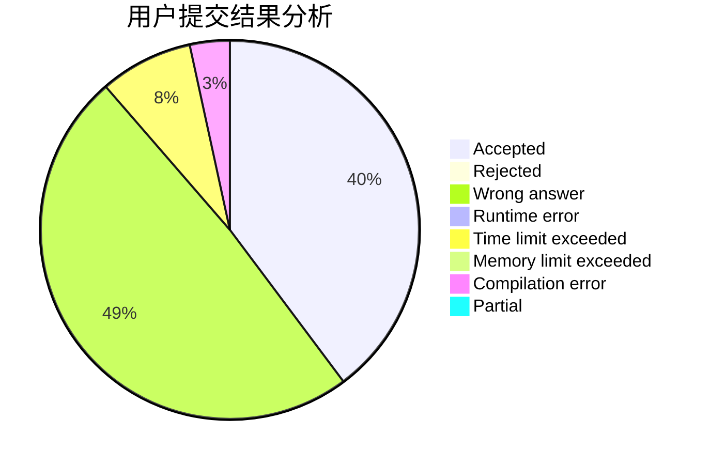
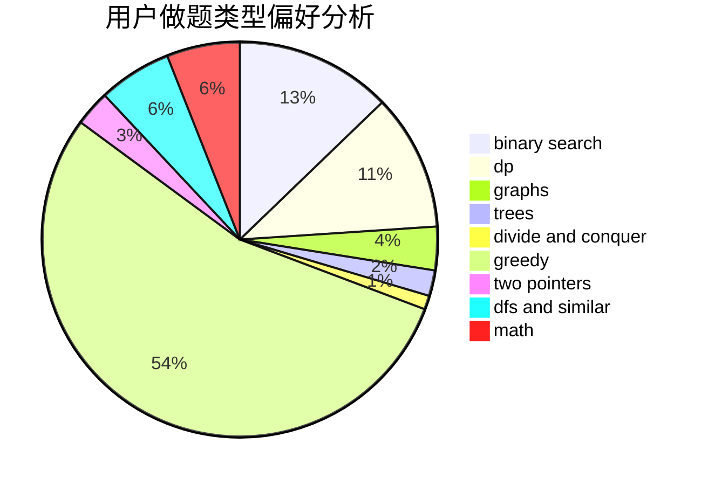

# niveton

<!-- tabs:start -->

#### **用户提交结果分析**

#### **用户做题类型偏好分析**

<!-- tabs:end -->
# 推荐题目
[721C](https://codeforces.com/contest/721/problem/C)
[856C](https://codeforces.com/contest/856/problem/C)
[864E](https://codeforces.com/contest/864/problem/E)
[551B](https://codeforces.com/contest/551/problem/B)
[730E](https://codeforces.com/contest/730/problem/E)
[618A](https://codeforces.com/contest/618/problem/A)
[893A](https://codeforces.com/contest/893/problem/A)
[1185F](https://codeforces.com/contest/1185/problem/F)
[1012B](https://codeforces.com/contest/1012/problem/B)
[1329D](https://codeforces.com/contest/1329/problem/D)
