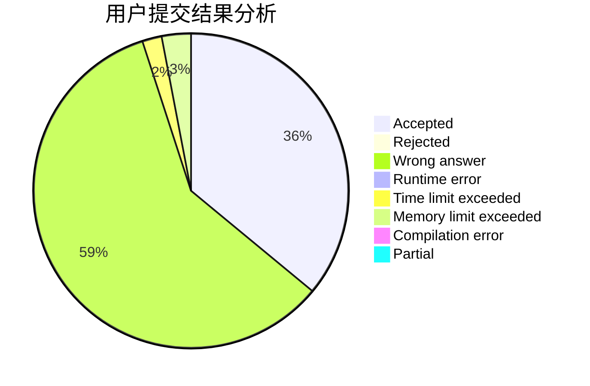
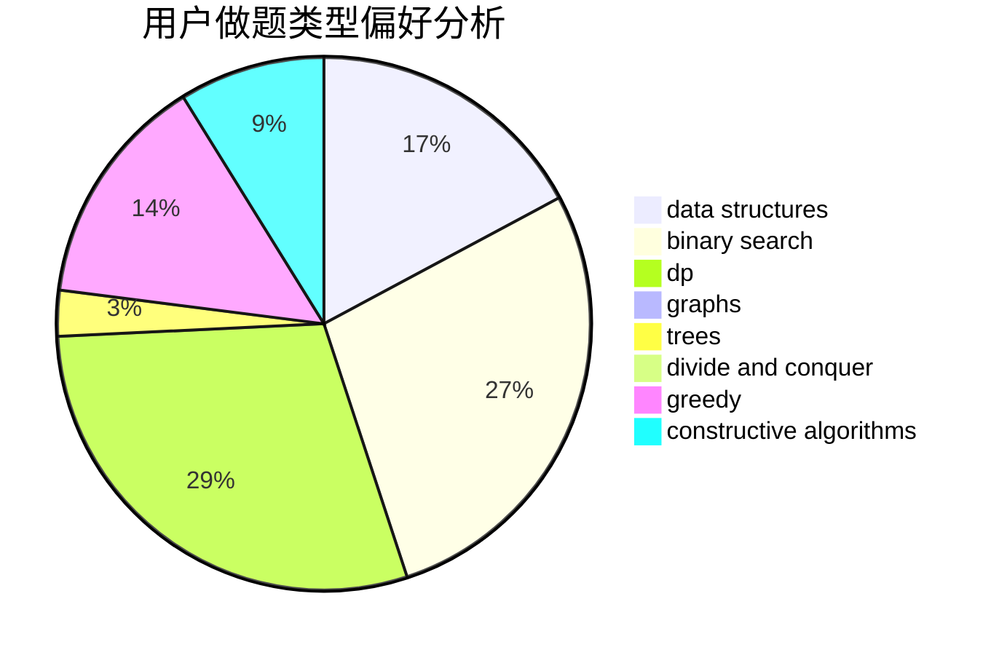
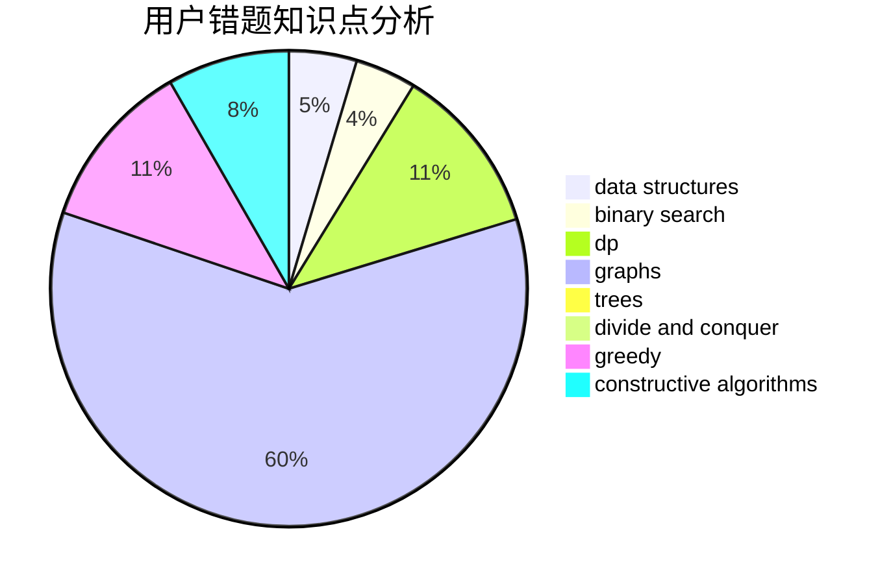

# njupt_lyy

<!-- tabs:start -->

#### **用户提交结果分析**

#### **用户做题类型偏好分析**

#### **用户错题知识点分析**

<!-- tabs:end -->
# 推荐题目
[896C](https://codeforces.com/contest/896/problem/C)		data structures,
                        probabilities		  
[1027F](https://codeforces.com/contest/1027/problem/F)		binary search,
                        dfs and similar,
                        dsu,
                        graph matchings,
                        graphs		  
[1499D](https://codeforces.com/contest/1499/problem/D)		dp,
                        math,
                        number theory		  
[12621](https://codeforces.com/contest/1262/problem/1)		dsu,graphs,sortings,trees		  
[961B](https://codeforces.com/contest/961/problem/B)		data structures,
                        dp,
                        implementation,
                        two pointers		  
[598D](https://codeforces.com/contest/598/problem/D)		dfs and similar,
                        graphs,
                        shortest paths		  
[1133A](https://codeforces.com/contest/1133/problem/A)		implementation		  
[1023A](https://codeforces.com/contest/1023/problem/A)		brute force,
                        implementation,
                        strings		  
[1060D](https://codeforces.com/contest/1060/problem/D)		greedy,
                        math		  
[1374D](https://codeforces.com/contest/1374/problem/D)		math,
                        sortings,
                        two pointers		  
