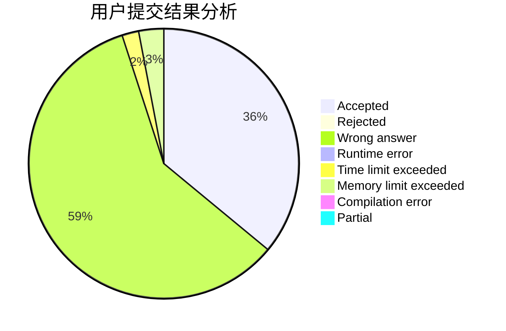
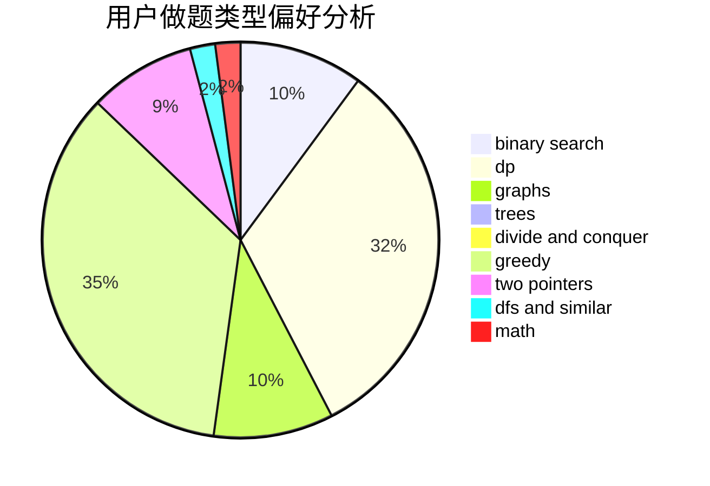

# njupt_lyy

<!-- tabs:start -->

#### **用户提交结果分析**

#### **用户做题类型偏好分析**

<!-- tabs:end -->
# 推荐题目
[896C](https://codeforces.com/contest/896/problem/C)
[1027F](https://codeforces.com/contest/1027/problem/F)
[1499D](https://codeforces.com/contest/1499/problem/D)
[12621](https://codeforces.com/contest/1262/problem/1)
[961B](https://codeforces.com/contest/961/problem/B)
[598D](https://codeforces.com/contest/598/problem/D)
[1133A](https://codeforces.com/contest/1133/problem/A)
[1023A](https://codeforces.com/contest/1023/problem/A)
[1060D](https://codeforces.com/contest/1060/problem/D)
[1374D](https://codeforces.com/contest/1374/problem/D)
