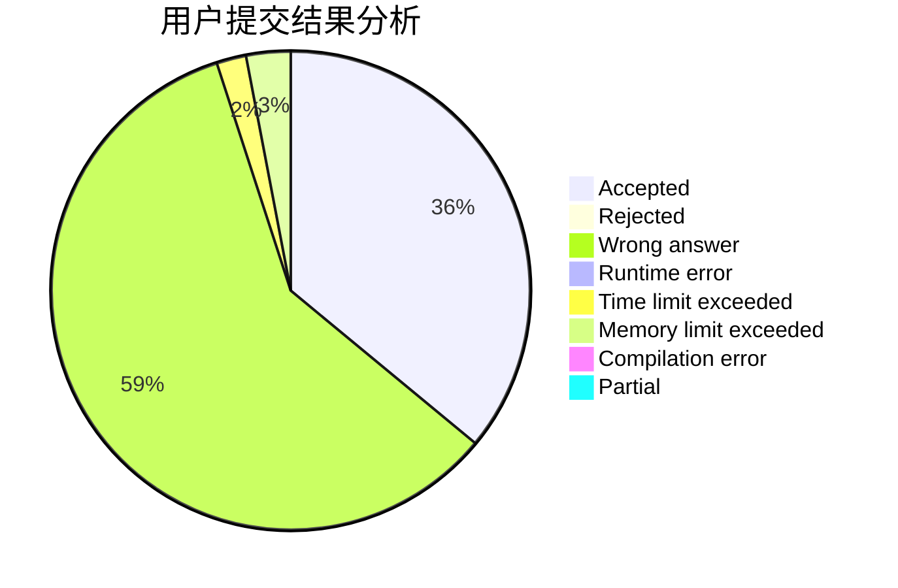
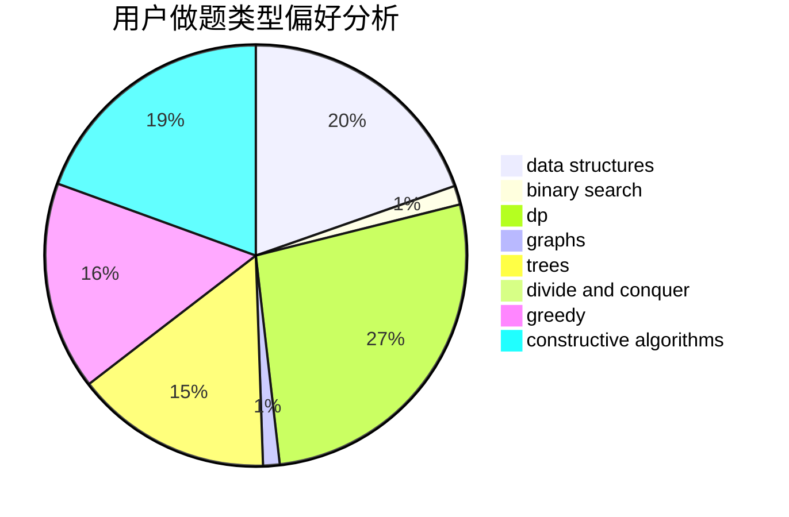
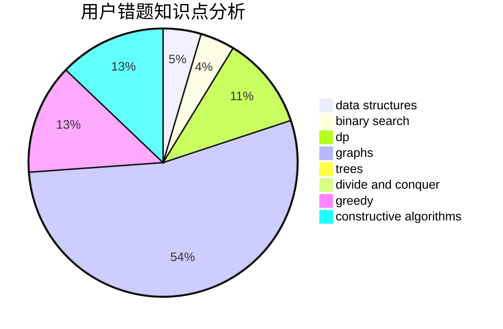

# njupt_lyy

<!-- tabs:start -->

#### **用户提交结果分析**

#### **用户做题类型偏好分析**

#### **用户错题知识点分析**

<!-- tabs:end -->
# 推荐题目
[876B](https://codeforces.com/contest/876/problem/B)		implementation,
                        math,
                        number theory		  
[1027C](https://codeforces.com/contest/1027/problem/C)		greedy		  
[1490E](https://codeforces.com/contest/1490/problem/E)		binary search,
                        data structures,
                        greedy		  
[1254D](https://codeforces.com/contest/1254/problem/D)		data structures,
                        probabilities,
                        trees		  
[93A](https://codeforces.com/contest/93/problem/A)		implementation		  
[576D](https://codeforces.com/contest/576/problem/D)		dp,
                        matrices		  
[1131D](https://codeforces.com/contest/1131/problem/D)		dfs and similar,
                        dp,
                        dsu,
                        graphs,
                        greedy		  
[1020C](https://codeforces.com/contest/1020/problem/C)		dsu,graphs,sortings,trees		  
[1060A](https://codeforces.com/contest/1060/problem/A)		brute force		  
[1367F2](https://codeforces.com/contest/1367F/problem/2)		binary search,
                        data structures,
                        dp,
                        greedy,
                        sortings,
                        two pointers		  
