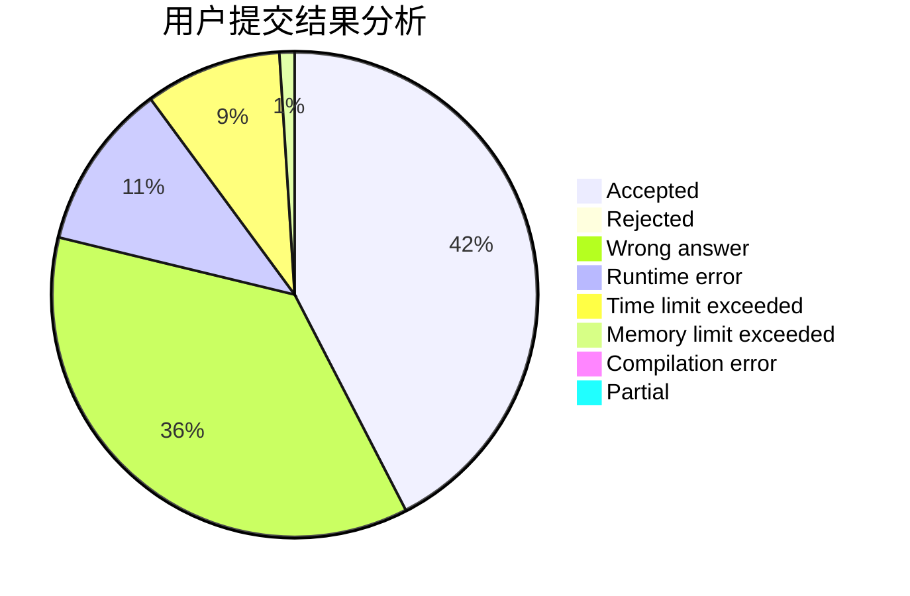
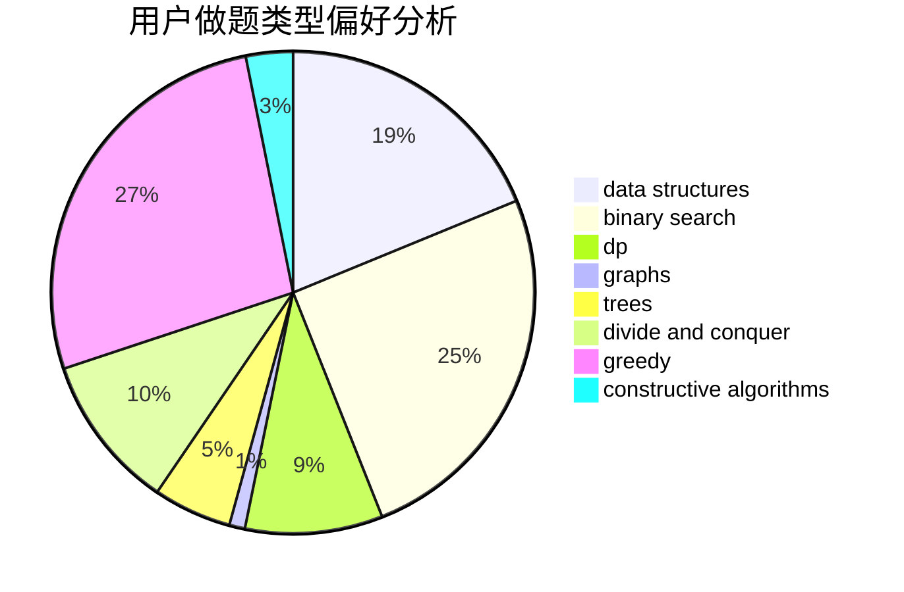
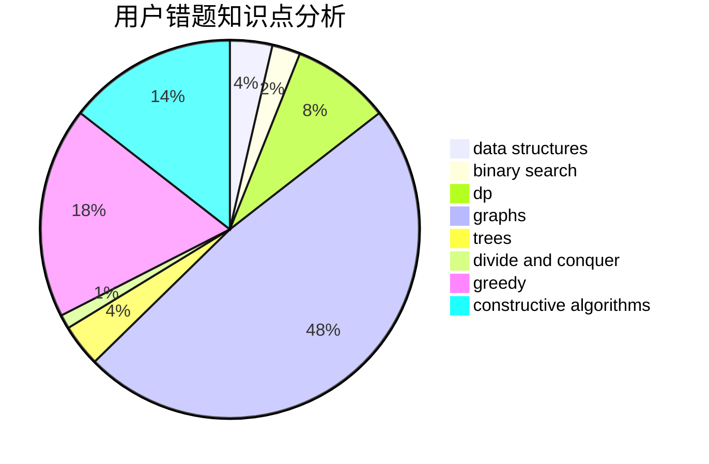

# njwrz

<!-- tabs:start -->

#### **用户提交结果分析**

#### **用户做题类型偏好分析**

#### **用户错题知识点分析**

<!-- tabs:end -->
# 推荐题目
[1028C](https://codeforces.com/contest/1028/problem/C)		geometry,
                        implementation,
                        sortings		  
[949A](https://codeforces.com/contest/949/problem/A)		greedy		  
[779A](https://codeforces.com/contest/779/problem/A)		constructive algorithms,
                        math		  
[1469E](https://codeforces.com/contest/1469/problem/E)		bitmasks,
                        brute force,
                        hashing,
                        string suffix structures,
                        strings,
                        two pointers		  
[1305D](https://codeforces.com/contest/1305/problem/D)		constructive algorithms,
                        dfs and similar,
                        interactive,
                        trees		  
[845B](https://codeforces.com/contest/845/problem/B)		brute force,
                        greedy,
                        implementation		  
[457C](https://codeforces.com/contest/457/problem/C)		brute force		  
[814E](https://codeforces.com/contest/814/problem/E)		combinatorics,
                        dp,
                        graphs,
                        shortest paths		  
[610A](https://codeforces.com/contest/610/problem/A)		combinatorics,
                        math		  
[621B](https://codeforces.com/contest/621/problem/B)		combinatorics,
                        implementation		  
