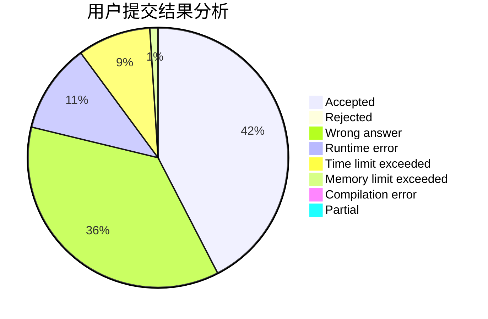
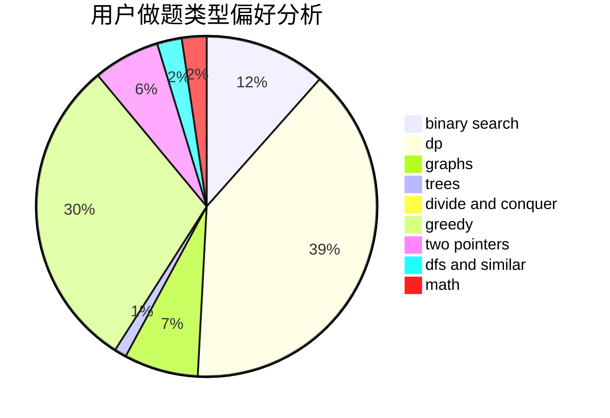

# njwrz

<!-- tabs:start -->

#### **用户提交结果分析**

#### **用户做题类型偏好分析**

<!-- tabs:end -->
# 推荐题目
[1028G](https://codeforces.com/contest/1028/problem/G)
[965E](https://codeforces.com/contest/965/problem/E)
[797C](https://codeforces.com/contest/797/problem/C)
[1477F](https://codeforces.com/contest/1477/problem/F)
[1314C](https://codeforces.com/contest/1314/problem/C)
[863C](https://codeforces.com/contest/863/problem/C)
[477C](https://codeforces.com/contest/477/problem/C)
[833C](https://codeforces.com/contest/833/problem/C)
[629C](https://codeforces.com/contest/629/problem/C)
[645D](https://codeforces.com/contest/645/problem/D)
