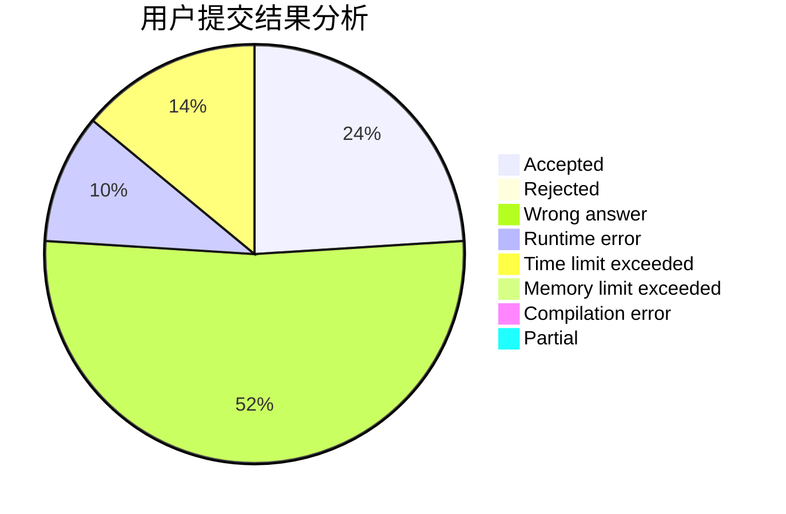
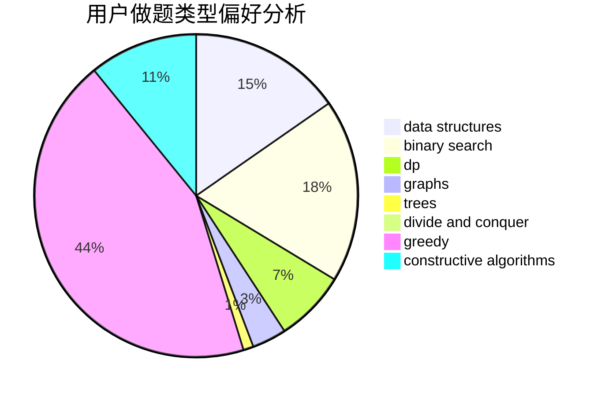
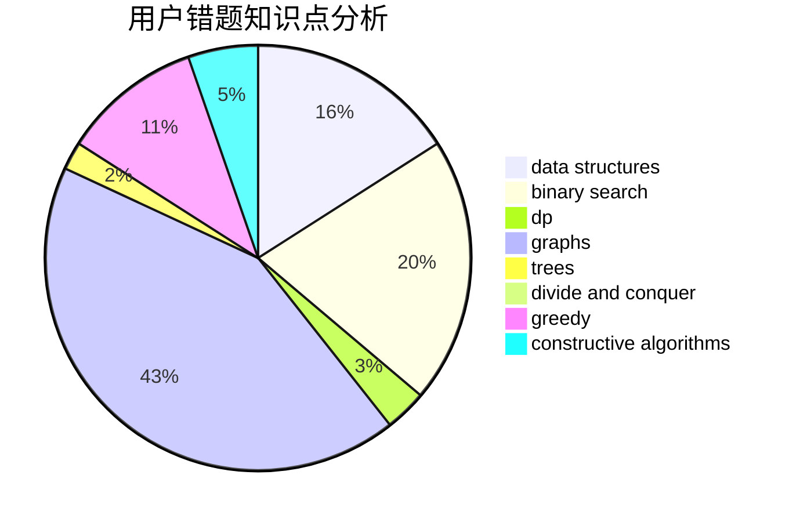

# Break_Zero

<!-- tabs:start -->

#### **用户提交结果分析**

#### **用户做题类型偏好分析**

#### **用户错题知识点分析**

<!-- tabs:end -->
# 推荐题目
[1501D](https://codeforces.com/contest/1501/problem/D)		dsu,graphs,sortings,trees		  
[520E](https://codeforces.com/contest/520/problem/E)		combinatorics,
                        dp,
                        math,
                        number theory		  
[566C](https://codeforces.com/contest/566/problem/C)		dfs and similar,
                        divide and conquer,
                        trees		  
[55D](https://codeforces.com/contest/55/problem/D)		dp,
                        number theory		  
[331C1](https://codeforces.com/contest/331C/problem/1)		dp		  
[1085B](https://codeforces.com/contest/1085/problem/B)		math		  
[560A](https://codeforces.com/contest/560/problem/A)		implementation,
                        sortings		  
[566A](https://codeforces.com/contest/566/problem/A)		dfs and similar,
                        strings,
                        trees		  
[1086E](https://codeforces.com/contest/1086/problem/E)		dsu,graphs,sortings,trees		  
[1186A](https://codeforces.com/contest/1186/problem/A)		implementation		  
