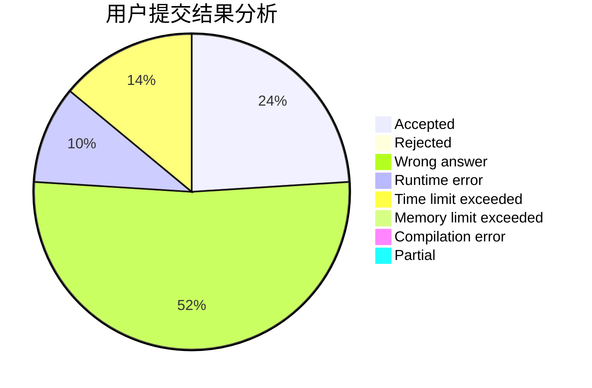
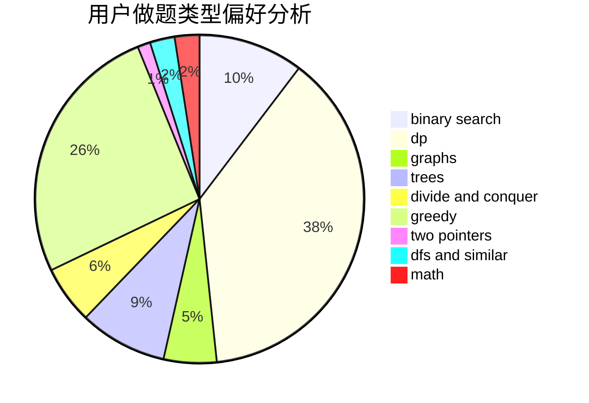

# Break_Zero

<!-- tabs:start -->

#### **用户提交结果分析**

#### **用户做题类型偏好分析**

<!-- tabs:end -->
# 推荐题目
[1511E](https://codeforces.com/contest/1511/problem/E)
[546D](https://codeforces.com/contest/546/problem/D)
[585B](https://codeforces.com/contest/585/problem/B)
[584B](https://codeforces.com/contest/584/problem/B)
[359B](https://codeforces.com/contest/359/problem/B)
[1085G](https://codeforces.com/contest/1085/problem/G)
[584C](https://codeforces.com/contest/584/problem/C)
[584E](https://codeforces.com/contest/584/problem/E)
[1087C](https://codeforces.com/contest/1087/problem/C)
[118D](https://codeforces.com/contest/118/problem/D)
