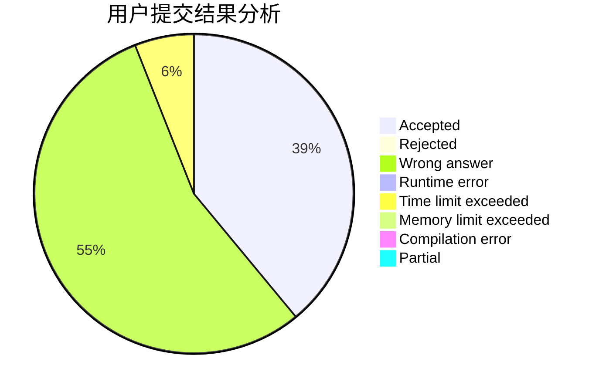
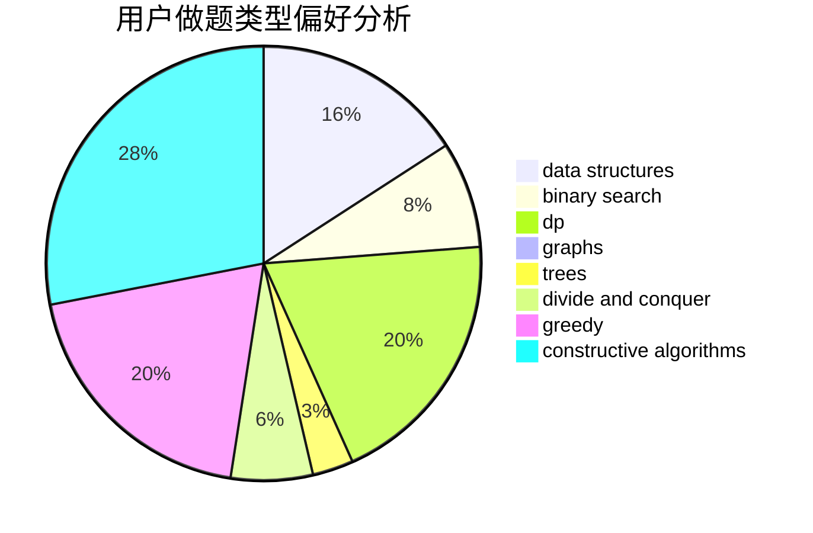
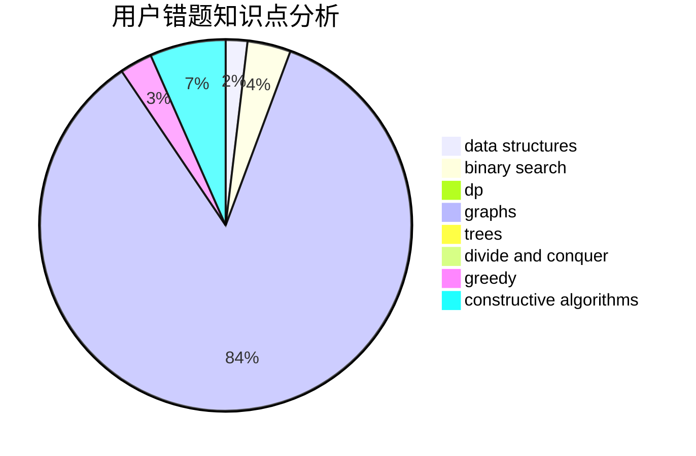

# njzwj2007

<!-- tabs:start -->

#### **用户提交结果分析**

#### **用户做题类型偏好分析**

#### **用户错题知识点分析**

<!-- tabs:end -->
# 推荐题目
[1283F](https://codeforces.com/contest/1283/problem/F)		constructive algorithms,
                        greedy,
                        trees		  
[644A](https://codeforces.com/contest/644/problem/A)		*special problem,
                        constructive algorithms		  
[845B](https://codeforces.com/contest/845/problem/B)		brute force,
                        greedy,
                        implementation		  
[231C](https://codeforces.com/contest/231/problem/C)		binary search,
                        sortings,
                        two pointers		  
[1199E](https://codeforces.com/contest/1199/problem/E)		dsu,graphs,sortings,trees		  
[1102A](https://codeforces.com/contest/1102/problem/A)		math		  
[53D](https://codeforces.com/contest/53/problem/D)		sortings		  
[578B](https://codeforces.com/contest/578/problem/B)		brute force,
                        greedy		  
[1359D](https://codeforces.com/contest/1359/problem/D)		data structures,
                        dp,
                        implementation,
                        two pointers		  
[1011B](https://codeforces.com/contest/1011/problem/B)		binary search,
                        brute force,
                        implementation		  
