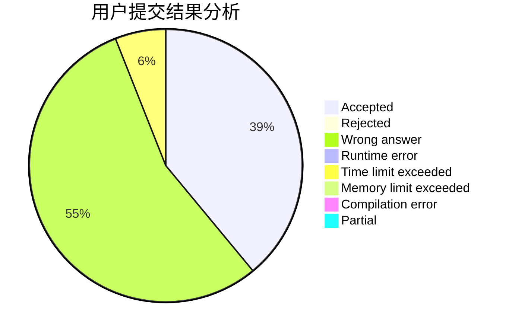
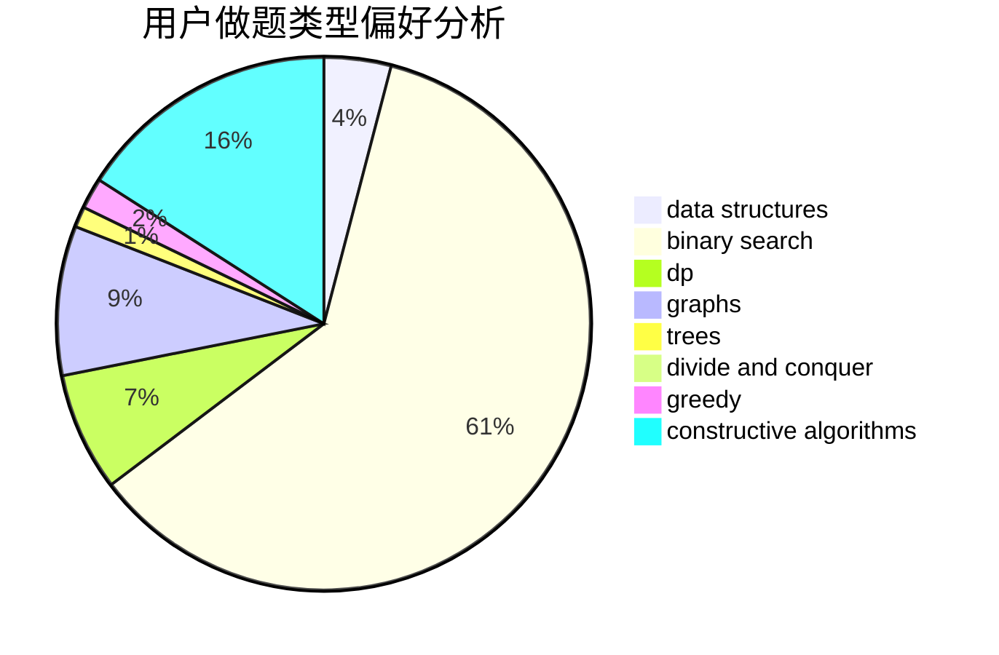
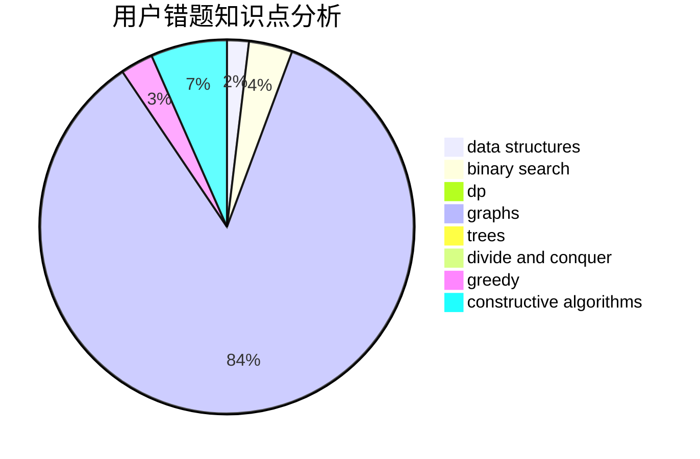

# njzwj2007

<!-- tabs:start -->

#### **用户提交结果分析**

#### **用户做题类型偏好分析**

#### **用户错题知识点分析**

<!-- tabs:end -->
# 推荐题目
[1290F](https://codeforces.com/contest/1290/problem/F)		dp		  
[671C](https://codeforces.com/contest/671/problem/C)		data structures,
                        number theory		  
[863C](https://codeforces.com/contest/863/problem/C)		graphs,
                        implementation		  
[253A](https://codeforces.com/contest/253/problem/A)		greedy		  
[1203A](https://codeforces.com/contest/1203/problem/A)		implementation		  
[1102D](https://codeforces.com/contest/1102/problem/D)		greedy,
                        strings		  
[560A](https://codeforces.com/contest/560/problem/A)		implementation,
                        sortings		  
[599D](https://codeforces.com/contest/599/problem/D)		brute force,
                        math		  
[1367C](https://codeforces.com/contest/1367/problem/C)		constructive algorithms,
                        greedy,
                        math		  
[1011E](https://codeforces.com/contest/1011/problem/E)		dsu,graphs,sortings,trees		  
