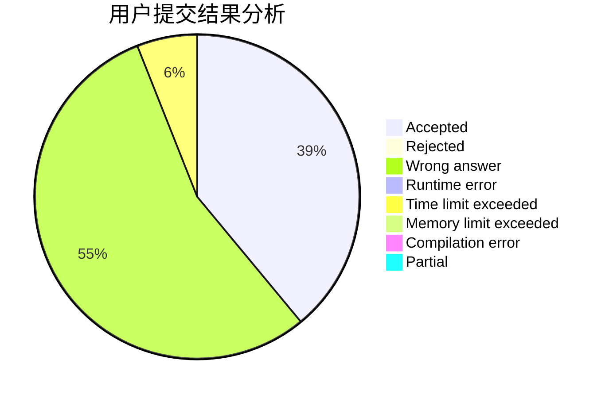
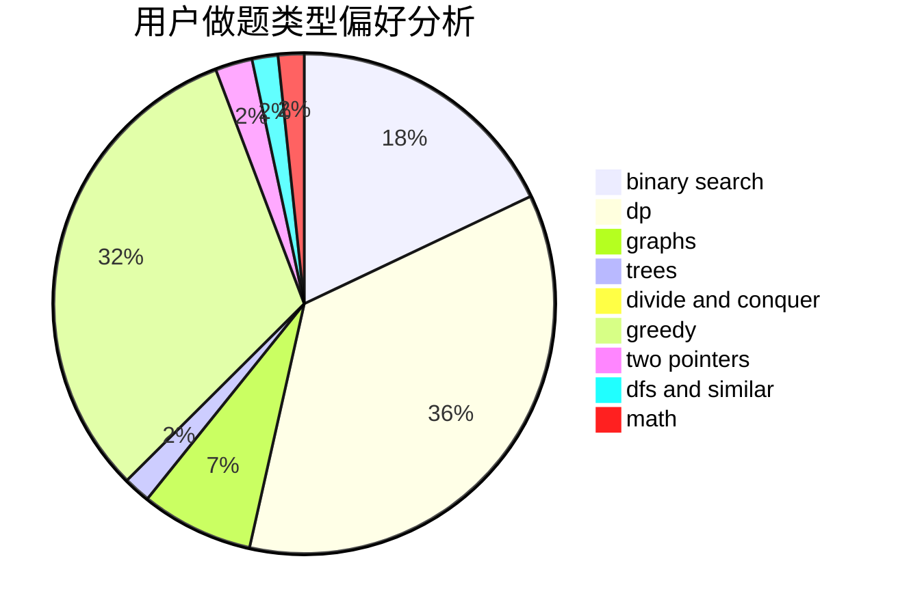

# njzwj2007

<!-- tabs:start -->

#### **用户提交结果分析**

#### **用户做题类型偏好分析**

<!-- tabs:end -->
# 推荐题目
[1290F](https://codeforces.com/contest/1290/problem/F)
[671C](https://codeforces.com/contest/671/problem/C)
[863C](https://codeforces.com/contest/863/problem/C)
[253A](https://codeforces.com/contest/253/problem/A)
[1203A](https://codeforces.com/contest/1203/problem/A)
[1102D](https://codeforces.com/contest/1102/problem/D)
[560A](https://codeforces.com/contest/560/problem/A)
[599D](https://codeforces.com/contest/599/problem/D)
[1367C](https://codeforces.com/contest/1367/problem/C)
[1011E](https://codeforces.com/contest/1011/problem/E)
