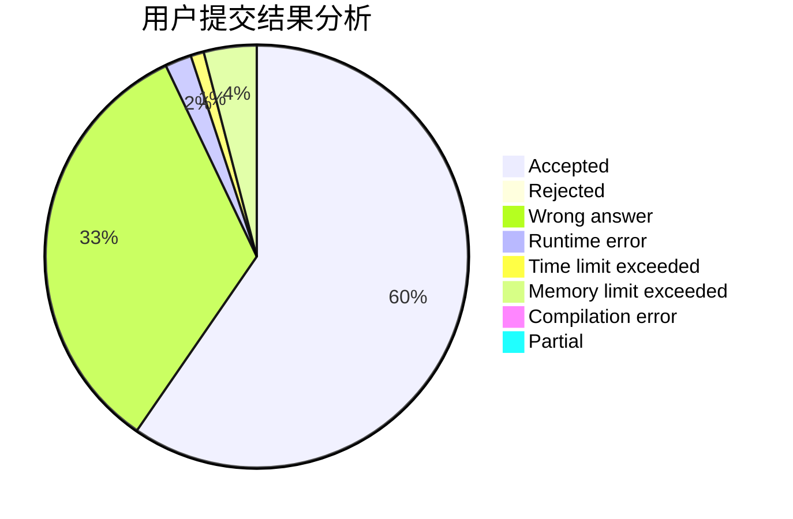
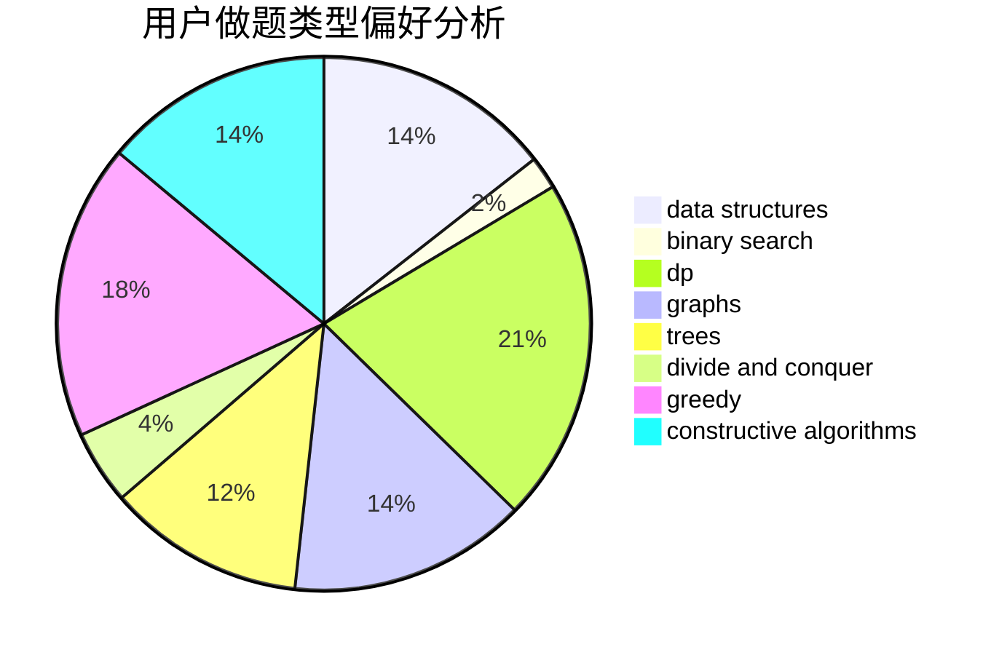
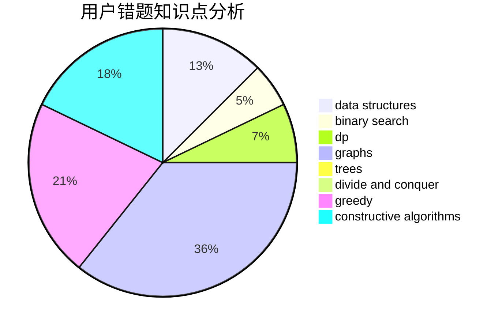

# nkxjlym

<!-- tabs:start -->

#### **用户提交结果分析**

#### **用户做题类型偏好分析**

#### **用户错题知识点分析**

<!-- tabs:end -->
# 推荐题目
[1248C](https://codeforces.com/contest/1248/problem/C)		dsu,graphs,sortings,trees		  
[266B](https://codeforces.com/contest/266/problem/B)		constructive algorithms,
                        graph matchings,
                        implementation,
                        shortest paths		  
[85A](https://codeforces.com/contest/85/problem/A)		constructive algorithms,
                        implementation		  
[138C](https://codeforces.com/contest/138/problem/C)		binary search,
                        data structures,
                        probabilities,
                        sortings		  
[1161C](https://codeforces.com/contest/1161/problem/C)		dsu,graphs,sortings,trees		  
[702A](https://codeforces.com/contest/702/problem/A)		dp,
                        greedy,
                        implementation		  
[1331E](https://codeforces.com/contest/1331/problem/E)		dfs and similar,
                        geometry,
                        implementation		  
[1062D](https://codeforces.com/contest/1062/problem/D)		dfs and similar,
                        graphs,
                        implementation,
                        math		  
[618G](https://codeforces.com/contest/618/problem/G)		dp,
                        math,
                        matrices,
                        probabilities		  
[801B](https://codeforces.com/contest/801/problem/B)		constructive algorithms,
                        greedy,
                        strings		  
