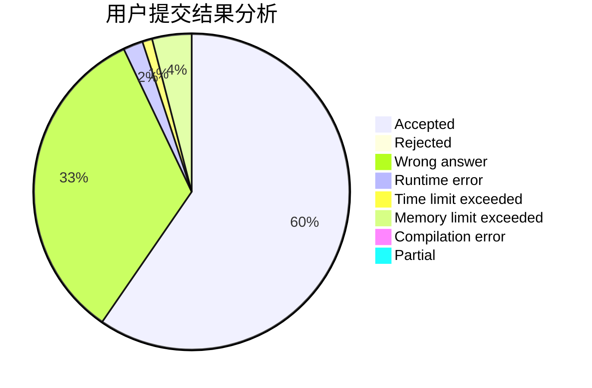
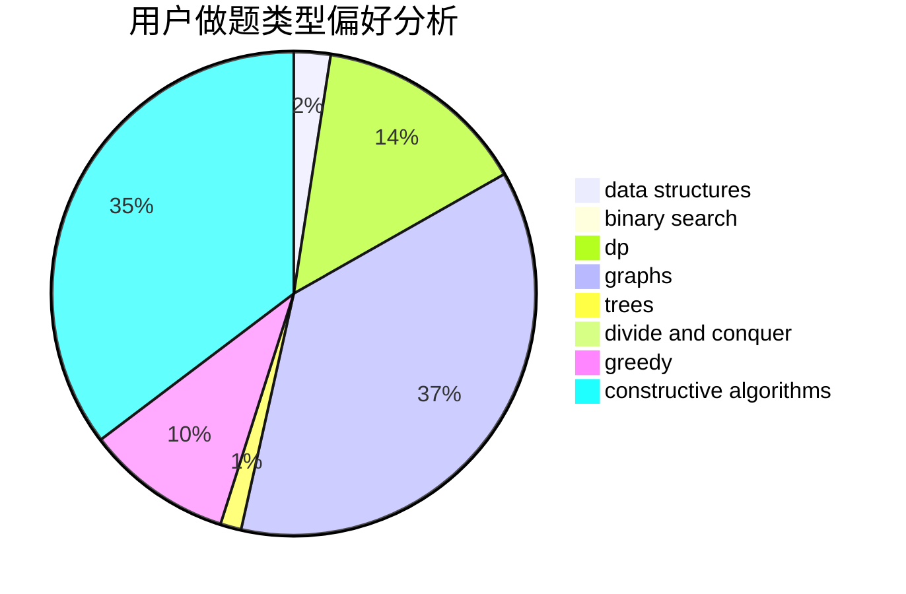
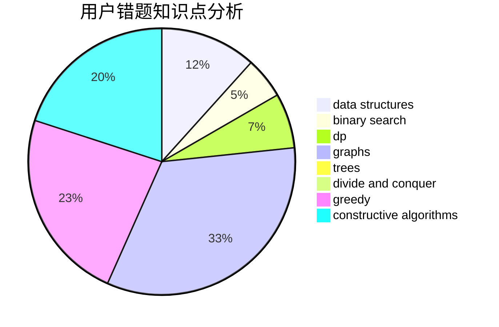

# nkxjlym

<!-- tabs:start -->

#### **用户提交结果分析**

#### **用户做题类型偏好分析**

#### **用户错题知识点分析**

<!-- tabs:end -->
# 推荐题目
[1243C](https://codeforces.com/contest/1243/problem/C)		dsu,graphs,sortings,trees		  
[245H](https://codeforces.com/contest/245/problem/H)		dp,
                        hashing,
                        strings		  
[840C](https://codeforces.com/contest/840/problem/C)		combinatorics,
                        dp		  
[1380E](https://codeforces.com/contest/1380/problem/E)		data structures,
                        dsu,
                        implementation,
                        trees		  
[1158D](https://codeforces.com/contest/1158/problem/D)		constructive algorithms,
                        geometry,
                        greedy,
                        math		  
[678C](https://codeforces.com/contest/678/problem/C)		implementation,
                        math,
                        number theory		  
[1325A](https://codeforces.com/contest/1325/problem/A)		constructive algorithms,
                        greedy,
                        number theory		  
[1062A](https://codeforces.com/contest/1062/problem/A)		greedy,
                        implementation		  
[600A](https://codeforces.com/contest/600/problem/A)		implementation,
                        strings		  
[784B](https://codeforces.com/contest/784/problem/B)		*special problem		  
