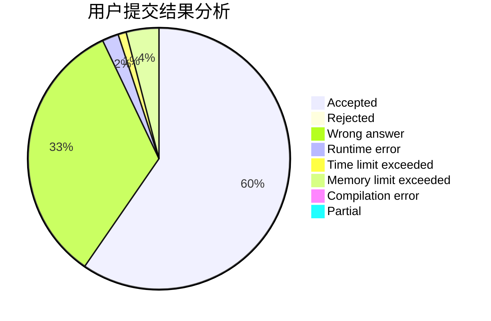
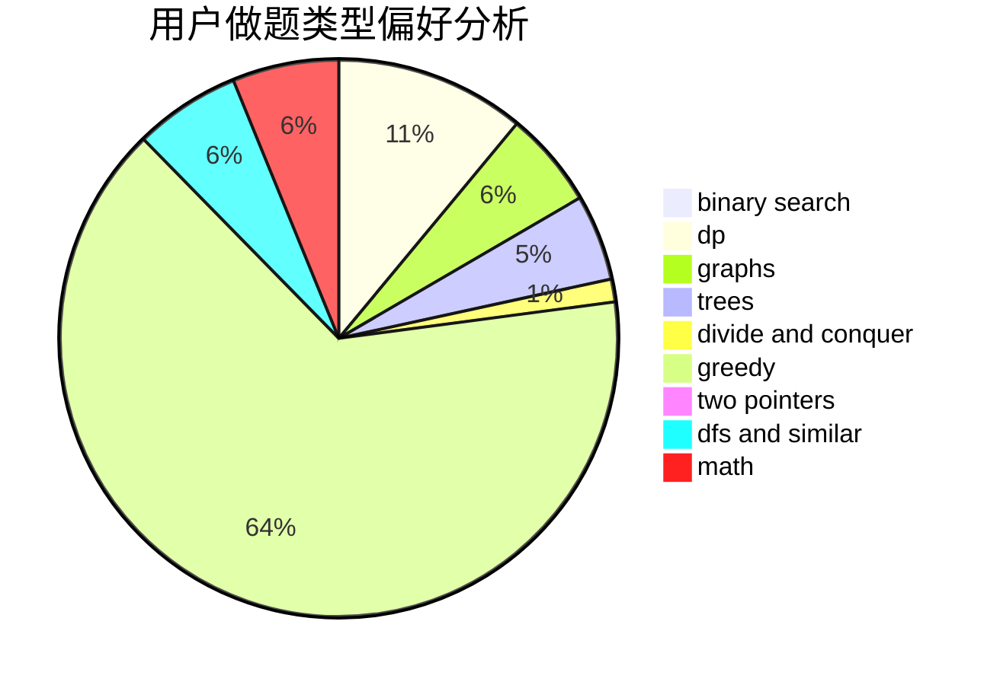

# nkxjlym

<!-- tabs:start -->

#### **用户提交结果分析**

#### **用户做题类型偏好分析**

<!-- tabs:end -->
# 推荐题目
[1248C](https://codeforces.com/contest/1248/problem/C)
[266B](https://codeforces.com/contest/266/problem/B)
[85A](https://codeforces.com/contest/85/problem/A)
[138C](https://codeforces.com/contest/138/problem/C)
[1161C](https://codeforces.com/contest/1161/problem/C)
[702A](https://codeforces.com/contest/702/problem/A)
[1331E](https://codeforces.com/contest/1331/problem/E)
[1062D](https://codeforces.com/contest/1062/problem/D)
[618G](https://codeforces.com/contest/618/problem/G)
[801B](https://codeforces.com/contest/801/problem/B)
