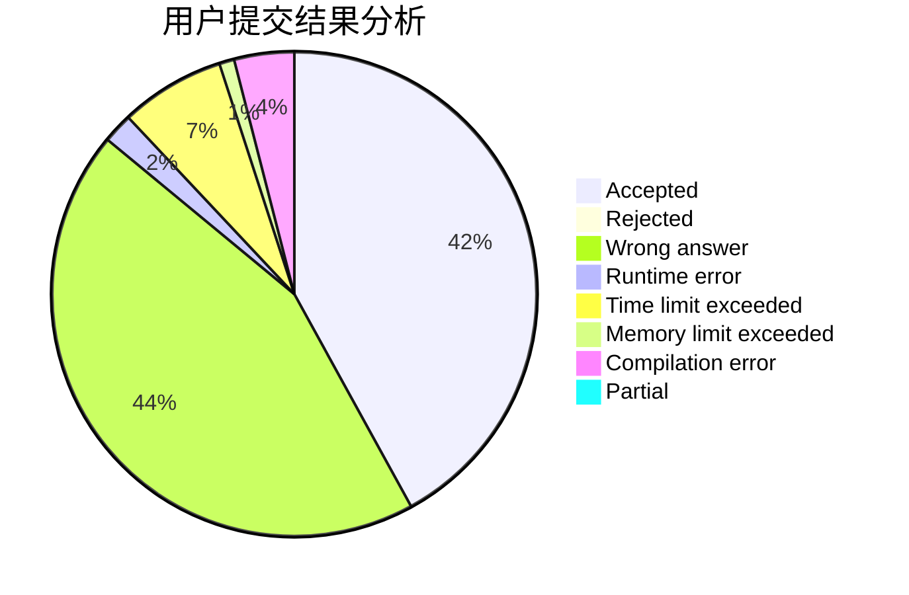
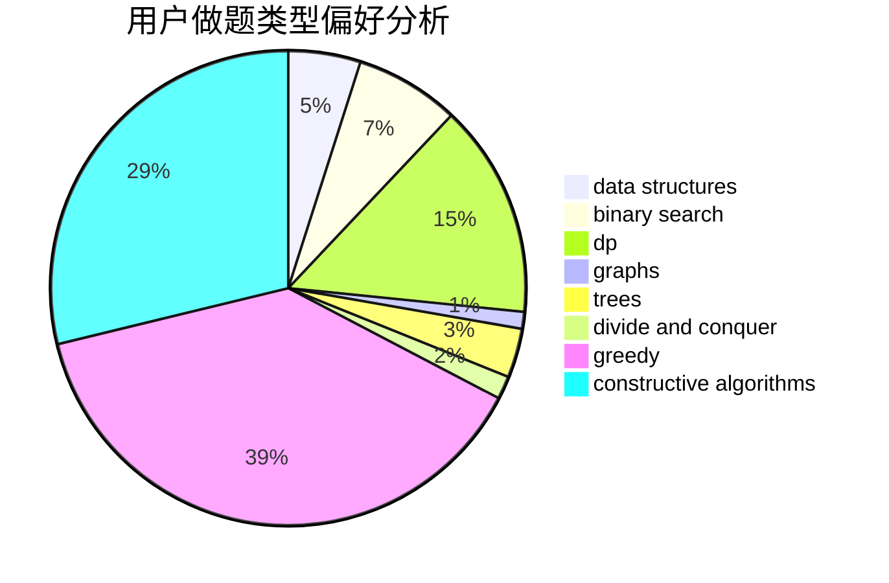
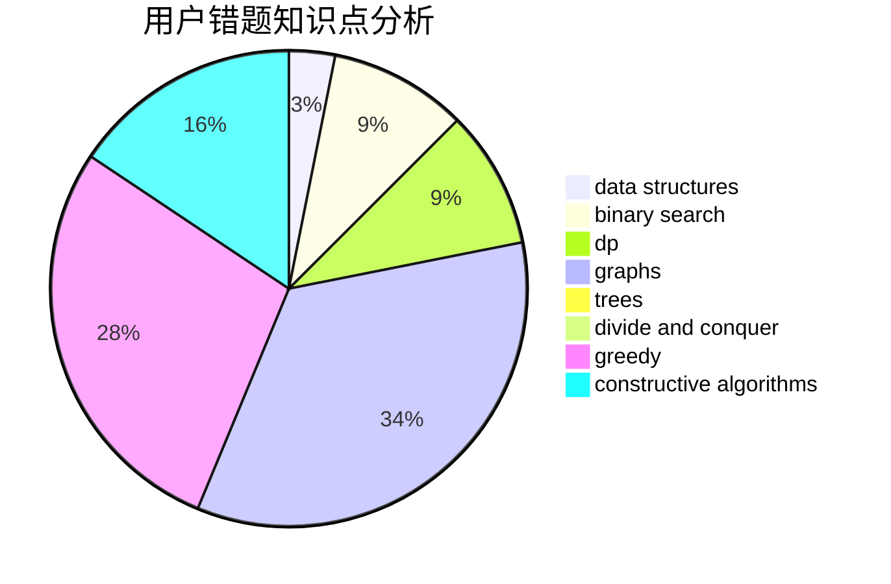

# nn020701

<!-- tabs:start -->

#### **用户提交结果分析**

#### **用户做题类型偏好分析**

#### **用户错题知识点分析**

<!-- tabs:end -->
# 推荐题目
[979B](https://codeforces.com/contest/979/problem/B)		greedy		  
[1427B](https://codeforces.com/contest/1427/problem/B)		greedy,
                        implementation,
                        sortings		  
[545A](https://codeforces.com/contest/545/problem/A)		implementation		  
[786C](https://codeforces.com/contest/786/problem/C)		data structures,
                        divide and conquer		  
[851B](https://codeforces.com/contest/851/problem/B)		geometry,
                        math		  
[1267B](https://codeforces.com/contest/1267/problem/B)		nan		  
[498E](https://codeforces.com/contest/498/problem/E)		dp,
                        matrices		  
[156D](https://codeforces.com/contest/156/problem/D)		combinatorics,
                        graphs		  
[1143B](https://codeforces.com/contest/1143/problem/B)		brute force,
                        math,
                        number theory		  
[225E](https://codeforces.com/contest/225/problem/E)		math,
                        number theory		  
